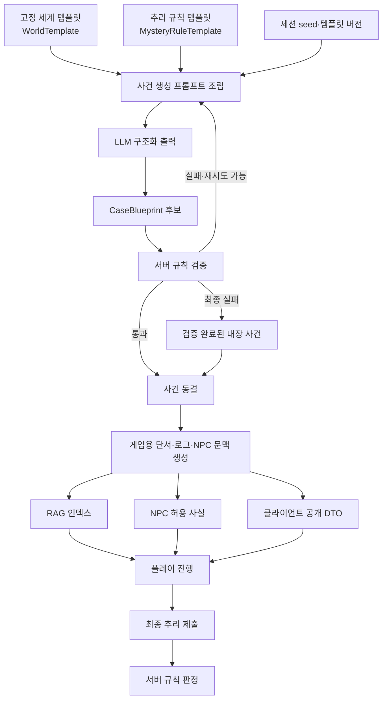

# Codex 구현 작업서 — 아르카디아 스테이션 AI 사건 생성 시스템

> 이 문서는 Codex에 그대로 전달하여 구현을 시작하기 위한 작업 명세서다.  
> 대상 프로젝트: NAN 2026 출품작 **「아르카디아 스테이션 사건」**  
> 기본 기술 전제: Spring Boot 3 / Java 21 / React / OpenAI API

---

## 0. Codex에게 내리는 작업 지시

현재 저장소를 먼저 점검한 뒤, 이 문서의 데이터 계약과 책임 경계를 기준으로 AI 게임 시스템을 구현하라.

구현 목표는 다음 세 계층을 모두 사용하는 것이다.

| 계층 | 소유자 | 역할 |
|---|---|---|
| 1. 고정 세계 템플릿 | 개발자 | 인물의 배경·직업·성격·능력·권한, 장소와 정거장 시스템을 정의한다. |
| 2. 추리 규칙 템플릿 | 개발자 | 사건이 공정한 추리 문제가 되기 위한 조건과 단서 획득·정답 판정 규칙을 정의한다. |
| 3. 이번 판 사건 설계 | AI | 위 두 계층을 위반하지 않는 새로운 살해 방법, 타임라인, 알리바이, 로그, 단서와 미끼 단서를 매 세션 생성한다. |

중요한 전제:

- **고정 세계 템플릿은 사건 줄거리 템플릿이 아니다.**
- **추리 규칙 템플릿은 살해 방법 템플릿이 아니다.**
- 실제 수법과 사건 내용은 고정 목록에서 고르는 것이 아니라 매 게임 시작 시 LLM이 새로 설계한다.
- 단, AI가 만든 사건은 서버 검증을 통과해야만 플레이에 사용한다.
- 생성된 사건은 세션 시작 시 확정하고 종료까지 변경하지 않는다.
- AI는 사건을 **작성**하지만, 게임 서버가 사건을 **검증·확정·집행·판정**한다.
- AI가 생성한 문자열을 코드, SQL, 스크립트 또는 임의 도구 호출로 실행하지 않는다.

저장소의 기존 패키지 구조나 명명 규칙이 이 문서와 다르면 기존 규칙에 맞추되, 아래의 도메인 계약과 보안 경계는 바꾸지 않는다. 기존 사용자 변경 사항과 관련 없는 파일은 수정하지 않는다. 구현 후 테스트 결과와 변경 파일을 보고한다.

---

## 1. 구현 목표

같은 인물인 소피아가 범인인 게임을 여러 번 실행하더라도 다음 항목이 매번 달라져야 한다.

- 범행 준비 방법
- 실제 실행 또는 촉발 방식
- 피해자가 위험에 빠진 조건
- 사건 발생 타임라인
- 물리 단서
- 디지털 로그
- 용의자별 알리바이
- 동기를 뒷받침하는 기록
- 다른 인물을 의심하게 하는 미끼 단서
- 단서를 찾는 순서와 일부 해금 조건

반대로 다음 항목은 개발자가 정한 세계관이므로 AI가 임의로 바꾸면 안 된다.

- 인물의 직업과 기본 성격
- 인물이 원래 가진 출입 권한
- 인물이 조작 가능한 정거장 시스템
- 장소와 시스템의 존재 여부
- 인물 간 기본 관계
- 물리 법칙과 정거장 운영 규칙
- 이번 버전의 범인 선정 정책
- 플레이어가 최종적으로 제출해야 하는 추리 항목
- 단서 공개, 획득, 정답 판정 규칙

### MVP 기본값

- 범인 정책: `FIXED`
- 범인: `SOPHIA`
- 게임 언어: 한국어
- 필수 추리 축: `SETUP`, `TRIGGER`, `OPPORTUNITY`, `MOTIVE`
- 선택 추리 축: `VICTIM_CONDITION`
- 사건 생성 시점: 새 게임 세션 생성 시 1회
- 사건 재생성: 검증 실패 시에만 서버 내부에서 최대 2회
- 최종 실패: 검증 완료된 내장 사건으로 폴백

미래에는 `RANDOM_FROM_ELIGIBLE` 정책을 추가할 수 있도록 타입을 열어 두되, MVP 동작은 소피아 고정으로 구현한다.

---

## 2. 핵심 아키텍처



### 반드시 지켜야 할 책임 경계

| 기능 | AI | 서버 |
|---|---|---|
| 새로운 사건 아이디어·수법 작성 | 담당 | 입력 제약 제공 |
| JSON 구조 준수 | 구조화 출력 사용 | 역직렬화·스키마 재검증 |
| 세계관·권한 모순 판정 | 보조 가능 | 최종 판정 |
| 범인이 유일한지 판정 | 금지 | 결정적 규칙으로 판정 |
| 단서 해금 | 문구 작성만 | 게임 상태에 따라 처리 |
| 발견하지 않은 진실 공개 | 금지 | 공개 가능한 사실만 AI에 전달 |
| RAG 검색 대상 | 요약만 | 세션의 확정 문서만 검색 |
| NPC의 말투 | 담당 | 허용 사실·거짓말 범위 통제 |
| 최종 정답 판정 | 금지 | 증거 ID와 규칙으로 판정 |

OpenAI의 Structured Outputs는 JSON Schema 형태를 안정적으로 맞추기 위한 수단이다. **논리적으로 올바른 사건임을 보장하는 수단은 아니므로 서버 검증기를 반드시 별도로 구현한다.**

공식 참고:

- [OpenAI Structured Outputs](https://developers.openai.com/api/docs/guides/structured-outputs)
- [OpenAI Retrieval](https://developers.openai.com/api/docs/guides/retrieval)
- [OpenAI Conversation state](https://developers.openai.com/api/docs/guides/conversation-state)

---

# 1계층 — 고정 세계 템플릿

## 3. `WorldTemplate`

고정 세계 템플릿은 AI가 자유롭게 사건을 만들 수 있는 **놀이터의 경계**다. 살해 방법이나 특정 단서 문장을 미리 지정하지 않는다.

권장 리소스 경로:

```text
src/main/resources/ai/world/arcadia-world-v1.json
src/main/resources/ai/schema/world-template.schema.json
```

### 3.1 포함해야 하는 정보

#### 세계 공통 정보

- 템플릿 ID와 버전
- 세계관 이름, 시대, 기본 상황
- 플레이어에게 공개 가능한 설정
- AI 생성에만 사용하는 비공개 설정
- 세계 불변 조건
- 존재 가능한 사건 기록의 출처
- 금지되는 설정과 능력

#### 인물 정보

각 인물에는 최소한 다음 필드가 필요하다.

- `id`: 바뀌지 않는 영문 식별자
- `displayName`
- `publicProfile`
- `occupation`
- `personalityTraits`
- `skills`
- `physicalAccess`: 출입 가능한 장소
- `systemPermissions`: 조작 가능한 시스템과 허용 작업
- `knowledgeDomains`
- `relationshipSeeds`: 기본 인간관계
- `motiveDomains`: AI가 구체화할 수 있는 동기 범위
- `privateBackground`: 사건 생성에는 쓰지만 클라이언트에 직접 보내지 않는 정보
- `forbiddenCapabilities`: 해당 인물에게 절대 부여할 수 없는 능력

#### 장소 정보

- 장소 ID와 명칭
- 공개 설명
- 출입 조건
- 연결된 장소
- 설치된 시스템
- 조사 가능한 오브젝트의 **종류**
- 생성 가능한 증거 출처

오브젝트 종류는 정의할 수 있지만, “이번 판의 부러진 레버”처럼 정답을 미리 정하는 구체 단서는 이 계층에 넣지 않는다.

#### 정거장 시스템 정보

- 시스템 ID와 명칭
- 담당 직군
- 접근 가능한 인물
- 허용 작업
- 의존 시스템
- 생성 가능한 로그 종류
- 시스템이 남기는 감사 기록
- 시스템의 세계관상 한계

실제 공격이나 살상에 재사용할 수 있는 현실적인 세부 절차는 저장하지 않는다. 게임에 필요한 허구적·비실행적 수준으로 모델링한다.

### 3.2 예시 구조

아래 값은 데이터 계약 예시다. 실제 인물 전체 정보는 기존 기획서에 맞게 채운다.

```json
{
  "templateId": "ARCADIA_WORLD",
  "version": "1.0.0",
  "locale": "ko-KR",
  "setting": {
    "name": "아르카디아 스테이션",
    "summary": "고립된 우주 정거장에서 발생한 사망 사건을 조사한다.",
    "worldInvariants": [
      "모든 보안 구역 출입은 개인 인증 기록을 남긴다.",
      "정거장 시스템은 등록된 권한 범위 밖의 명령을 거부한다.",
      "사건에 등장하는 장소와 시스템은 이 템플릿에 등록된 ID만 사용한다."
    ],
    "forbiddenElements": [
      "초능력",
      "시간 여행",
      "등록되지 않은 비밀 통로",
      "검증 불가능한 제3의 인물",
      "현실에서 실행 가능한 상세 살해 절차"
    ]
  },
  "characters": [
    {
      "id": "SOPHIA",
      "displayName": "소피아",
      "occupation": "정거장 시스템 엔지니어",
      "publicProfile": "정거장 핵심 설비의 안정성과 유지보수를 담당한다.",
      "personalityTraits": ["침착함", "논리적", "통제 욕구"],
      "skills": ["SYSTEM_DIAGNOSIS", "MAINTENANCE_PLANNING"],
      "physicalAccess": ["MAINTENANCE_HUB", "LIFE_SUPPORT_CORRIDOR"],
      "systemPermissions": [
        {
          "systemId": "LIFE_SUPPORT",
          "allowedOperations": ["READ_STATUS", "RUN_DIAGNOSTIC", "SCHEDULE_MAINTENANCE"]
        }
      ],
      "knowledgeDomains": ["정거장 설비", "점검 절차", "시스템 감사 로그"],
      "motiveDomains": ["직업적 갈등", "은폐된 과실", "통제권 다툼"],
      "relationshipSeeds": [
        {
          "characterId": "VICTIM",
          "publicRelation": "업무상 자주 충돌했다.",
          "privatePossibilities": ["책임 전가", "과거 점검 결과 갈등"]
        }
      ],
      "forbiddenCapabilities": [
        "MEDICAL_ADMIN",
        "SECURITY_MASTER_OVERRIDE",
        "UNLOGGED_TELEPORTATION"
      ]
    }
  ],
  "locations": [
    {
      "id": "MAINTENANCE_HUB",
      "displayName": "정비 허브",
      "connectedLocationIds": ["LIFE_SUPPORT_CORRIDOR"],
      "installedSystemIds": ["MAINTENANCE_TERMINAL"],
      "evidenceSourceTypes": ["PHYSICAL_OBJECT", "ACCESS_LOG", "WORK_ORDER"]
    }
  ],
  "systems": [
    {
      "id": "LIFE_SUPPORT",
      "displayName": "생명 유지 시스템",
      "allowedOperations": [
        "READ_STATUS",
        "RUN_DIAGNOSTIC",
        "SCHEDULE_MAINTENANCE"
      ],
      "auditSourceTypes": ["COMMAND_LOG", "ALERT_LOG", "MAINTENANCE_LOG"],
      "limitations": [
        "등록되지 않은 권한으로는 설정을 변경할 수 없다.",
        "중요 작업은 감사 로그 또는 물리 흔적 중 하나 이상을 남긴다."
      ]
    }
  ],
  "evidenceSources": [
    {
      "type": "ACCESS_LOG",
      "requiredMetadataKeys": ["timestamp", "actorId", "locationId", "result"]
    },
    {
      "type": "COMMAND_LOG",
      "requiredMetadataKeys": ["timestamp", "actorId", "systemId", "operation"]
    }
  ]
}
```

### 3.3 1계층 검증기

애플리케이션 시작 시 `WorldTemplateValidator`가 다음을 검사한다.

- 모든 ID가 중복되지 않는다.
- 인물의 출입 장소와 시스템 권한이 실제 등록된 ID를 참조한다.
- 관계 대상 인물이 실제로 존재한다.
- 시스템의 허용 작업이 중복되지 않는다.
- `forbiddenCapabilities`와 실제 권한이 충돌하지 않는다.
- 최소 용의자 수와 조사 장소 수를 만족한다.
- 모든 증거 출처가 요구 메타데이터를 정의한다.
- 템플릿 버전이 저장 가능한 형식이다.

잘못된 고정 템플릿으로는 애플리케이션이 정상 시작되지 않도록 fail-fast 처리한다.

---

# 2계층 — 추리 규칙 템플릿

## 4. `MysteryRuleTemplate`

추리 규칙 템플릿은 **어떤 사건이 정답으로 인정될 수 있는지**를 정의한다. 수법이나 단서의 실제 내용을 넣지 않는다.

권장 리소스 경로:

```text
src/main/resources/ai/rules/arcadia-mystery-rules-v1.json
src/main/resources/ai/schema/mystery-rule-template.schema.json
```

### 4.1 포함해야 하는 정보

#### 범인 정책

- MVP: `FIXED`
- `culpritId`: `SOPHIA`
- 미래 확장: `RANDOM_FROM_ELIGIBLE`

#### 필수 추리 축

| 역할 | 의미 | 필수 여부 |
|---|---|---:|
| `SETUP` | 범행을 가능하게 만든 사전 준비의 증거 | 필수 |
| `TRIGGER` | 실제 사건을 발생시킨 행동 또는 장치의 증거 | 필수 |
| `OPPORTUNITY` | 범인에게 장소·시간·권한상 기회가 있었다는 증거 | 필수 |
| `MOTIVE` | 범행 동기를 뒷받침하는 증거 | 필수 |
| `VICTIM_CONDITION` | 피해자가 위험에 빠진 추가 조건 | 선택 |

#### 단서 구성 규칙

권장 MVP 기본값:

- 핵심 단서: 4~6개
- 미끼 단서: 1~3개
- 물리 단서: 최소 1개
- 디지털 기록: 최소 1개
- 권한 또는 기회 단서: 최소 1개
- 동기 단서: 최소 1개
- 필수 추리 축마다 제출 가능한 증거 1개 이상
- 하나의 핵심 사실이 오직 한 번의 AI 대화에서만 얻어지는 구조 금지
- 엔딩에 필요한 핵심 단서는 모두 결정적인 게임 행동으로 획득 가능해야 함

#### 유일해 조건

사건의 모든 핵심 단서를 적용했을 때 범인 후보 집합은 정확히 한 명이어야 한다.

```text
candidateSet(allRequiredEvidence) == {SOPHIA}
```

또한 다른 용의자마다 최소 하나 이상의 명시적인 배제 근거가 있어야 한다.

#### 단서 획득 규칙

- `EXPLORE`: 장소나 오브젝트 조사로 획득
- `INTERROGATE`: 특정 심문 주제와 선행 단서 충족 시 획득
- `RAG_QUERY`: 확정된 사건 기록 검색으로 획득
- `CONNECT`: 두 개 이상의 이미 획득한 단서를 연결하면 획득
- `AUTO`: 세션 시작 또는 단계 전환 시 공개

AI는 각 단서의 획득 방식을 제안하지만, 실제 해금 가능 여부와 획득 처리는 서버가 판단한다.

### 4.2 예시 구조

```json
{
  "templateId": "ARCADIA_MYSTERY_RULES",
  "version": "1.0.0",
  "culpritPolicy": {
    "type": "FIXED",
    "culpritId": "SOPHIA"
  },
  "requiredEvidenceRoles": [
    "SETUP",
    "TRIGGER",
    "OPPORTUNITY",
    "MOTIVE"
  ],
  "optionalEvidenceRoles": ["VICTIM_CONDITION"],
  "clueRules": {
    "coreClueCount": {"min": 4, "max": 6},
    "redHerringCount": {"min": 1, "max": 3},
    "minimumByType": {
      "PHYSICAL": 1,
      "DIGITAL": 1,
      "MOTIVE": 1,
      "OPPORTUNITY": 1
    },
    "allowedAcquisitionTypes": [
      "EXPLORE",
      "INTERROGATE",
      "RAG_QUERY",
      "CONNECT",
      "AUTO"
    ],
    "maxPrerequisiteDepth": 3,
    "mandatoryFactsRequireDeterministicPath": true
  },
  "solutionRules": {
    "requireUniqueCulprit": true,
    "requireExplicitExclusionForEveryNonCulprit": true,
    "rejectUnregisteredWorldIds": true,
    "rejectForbiddenCapabilities": true,
    "requireChronologicalConsistency": true,
    "requireEvidenceForEveryRequiredRole": true
  },
  "finalReportRules": {
    "requireCulprit": true,
    "requiredRoles": [
      "SETUP",
      "TRIGGER",
      "OPPORTUNITY",
      "MOTIVE"
    ],
    "allowRetry": true,
    "maxWrongSubmissions": 3
  },
  "generationSafety": {
    "fictionalNonActionableMethodOnly": true,
    "forbidExecutableCode": true,
    "forbidNewCharacters": true,
    "forbidNewLocations": true,
    "forbidNewSystems": true
  }
}
```

### 4.3 2계층 검증기

`MysteryRuleTemplateValidator`가 다음을 검사한다.

- 고정 범인이 `WorldTemplate`에 존재한다.
- 필수 추리 축이 중복되지 않는다.
- 최소·최대 단서 수가 모순되지 않는다.
- 허용된 단서 획득 방식만 사용한다.
- 필수 단서 수가 필수 추리 축 수보다 작지 않다.
- 유일해 검증이 비활성화되어 있지 않다.
- 최종 보고서 필수 역할과 사건 생성 필수 역할이 일치한다.

---

# 3계층 — 이번 판 사건 설계

## 5. `CaseBlueprint`

`CaseBlueprint`는 매 게임 세션 시작 시 AI가 새로 만드는 사건의 전체 설계도다.

이 객체가 검증되고 동결된 뒤에는 그 세션의 유일한 사건 진실이 된다. 게임 도중 NPC 대화나 RAG 응답이 `CaseBlueprint`에 없는 새로운 사실을 만들어서는 안 된다.

권장 스키마 경로:

```text
src/main/resources/ai/schema/case-blueprint.schema.json
```

JSON Schema에는 가능한 모든 객체에 `additionalProperties: false`를 적용하고, enum과 필수 필드를 명시한다.

### 5.1 반드시 생성할 정보

- 사건 ID, 세션 seed, 참조 템플릿 버전
- 범인 ID
- 사건 제목과 비스포일러 브리핑
- 사건의 진실 요약
- 준비 행동
- 실행 또는 촉발 행동
- 피해자 상태 조건
- 시간순 사건 타임라인
- 범행에 실제 사용된 장소·시스템·권한
- 모든 용의자의 알리바이
- 핵심 사실
- 핵심 단서
- 미끼 단서
- 검색 가능한 통신·출입·시스템·정비 기록
- NPC가 알고 있는 사실과 처음에 주장할 내용
- 최종 추리에 제출해야 하는 증거 ID
- 각 비범인 용의자의 배제 근거

### 5.2 예시 구조

아래 내용은 구조 예시이며 실제 고정 수법으로 사용하지 않는다.

```json
{
  "blueprintId": "CASE-01JEXAMPLE",
  "seed": "session-generated-seed",
  "worldTemplate": {
    "id": "ARCADIA_WORLD",
    "version": "1.0.0"
  },
  "ruleTemplate": {
    "id": "ARCADIA_MYSTERY_RULES",
    "version": "1.0.0"
  },
  "culpritId": "SOPHIA",
  "title": "정지된 교대 기록",
  "briefing": "교대 직전 발생한 정거장 사망 사건의 원인과 책임자를 찾아야 한다.",
  "truthSummary": "소피아는 자신의 정식 권한 안에서 실행 가능한 두 작업의 시간차를 이용해 사건을 준비하고 촉발했다.",
  "method": {
    "fictionalSummary": "정거장 내부의 허구적 안전 연동이 특정 조건에서 잘못 작동하도록 준비했다.",
    "setupAction": {
      "actorId": "SOPHIA",
      "locationId": "MAINTENANCE_HUB",
      "systemId": "LIFE_SUPPORT",
      "operation": "SCHEDULE_MAINTENANCE",
      "requiredCapabilityIds": ["MAINTENANCE_PLANNING"]
    },
    "triggerAction": {
      "actorId": "SOPHIA",
      "locationId": "LIFE_SUPPORT_CORRIDOR",
      "systemId": "LIFE_SUPPORT",
      "operation": "RUN_DIAGNOSTIC",
      "requiredCapabilityIds": ["SYSTEM_DIAGNOSIS"]
    },
    "victimCondition": "피해자가 예정과 다른 시각에 점검 구역에 들어갔다."
  },
  "timeline": [
    {
      "eventId": "EVT-001",
      "time": "01:42",
      "actorIds": ["SOPHIA"],
      "locationId": "MAINTENANCE_HUB",
      "actionType": "SYSTEM_ACTION",
      "summary": "사전 준비 작업이 수행됐다.",
      "factIds": ["FACT-SETUP"]
    },
    {
      "eventId": "EVT-002",
      "time": "02:03",
      "actorIds": ["SOPHIA"],
      "locationId": "LIFE_SUPPORT_CORRIDOR",
      "actionType": "SYSTEM_ACTION",
      "summary": "사건을 촉발한 작업이 수행됐다.",
      "factIds": ["FACT-TRIGGER"]
    }
  ],
  "facts": [
    {
      "factId": "FACT-SETUP",
      "kind": "ACTION",
      "statement": "사건 전 사전 준비 작업이 실행됐다.",
      "truthValue": true,
      "subjectCharacterIds": ["SOPHIA"]
    },
    {
      "factId": "FACT-TRIGGER",
      "kind": "ACTION",
      "statement": "준비 작업과 연결되는 후속 진단이 실행됐다.",
      "truthValue": true,
      "subjectCharacterIds": ["SOPHIA"]
    }
  ],
  "alibis": [
    {
      "characterId": "SOPHIA",
      "initialClaim": "해당 시간에는 통상 점검만 수행했다.",
      "actualWhereabouts": "정비 허브와 생명 유지 통로",
      "supportingFactIds": [],
      "contradictingFactIds": ["FACT-SETUP", "FACT-TRIGGER"]
    }
  ],
  "clues": [
    {
      "clueId": "CLUE-SETUP-LOG",
      "title": "예약 작업 기록",
      "clueType": "DIGITAL",
      "isCore": true,
      "solutionRoles": ["SETUP"],
      "source": {
        "sourceType": "MAINTENANCE_LOG",
        "sourceId": "RECORD-001"
      },
      "acquisition": {
        "type": "RAG_QUERY",
        "locationId": null,
        "characterId": null,
        "requiredClueIds": [],
        "queryTopics": ["예약 작업", "교대 전 정비"]
      },
      "revealsFactIds": ["FACT-SETUP"],
      "playerText": "교대 전에 등록된 예약 작업의 흔적이다.",
      "suspectEffects": [
        {"characterId": "SOPHIA", "effect": "SUPPORTS"},
        {"characterId": "OTHER_SUSPECT", "effect": "EXCLUDES"}
      ]
    },
    {
      "clueId": "CLUE-TRIGGER-TRACE",
      "title": "진단 실행 흔적",
      "clueType": "PHYSICAL",
      "isCore": true,
      "solutionRoles": ["TRIGGER", "OPPORTUNITY"],
      "source": {
        "sourceType": "PHYSICAL_OBJECT",
        "sourceId": "OBJECT-001"
      },
      "acquisition": {
        "type": "EXPLORE",
        "locationId": "LIFE_SUPPORT_CORRIDOR",
        "characterId": null,
        "requiredClueIds": [],
        "queryTopics": []
      },
      "revealsFactIds": ["FACT-TRIGGER"],
      "playerText": "최근 진단 실행과 연결되는 물리 흔적이다.",
      "suspectEffects": [
        {"characterId": "SOPHIA", "effect": "SUPPORTS"}
      ]
    }
  ],
  "evidenceRecords": [
    {
      "recordId": "RECORD-001",
      "recordType": "MAINTENANCE_LOG",
      "timestamp": "01:42",
      "title": "예약 작업 감사 기록",
      "body": "교대 전 예약 작업이 등록되었고 담당 인증 정보가 일부 남아 있다.",
      "metadata": {
        "actorId": "SOPHIA",
        "systemId": "LIFE_SUPPORT",
        "operation": "SCHEDULE_MAINTENANCE"
      },
      "revealsClueIds": ["CLUE-SETUP-LOG"],
      "searchTerms": ["예약", "교대", "정비"],
      "visibility": "SEARCHABLE"
    }
  ],
  "npcKnowledge": [
    {
      "characterId": "SOPHIA",
      "knownFactIds": ["FACT-SETUP", "FACT-TRIGGER"],
      "initialClaimFactIds": [],
      "concealedFactIds": ["FACT-SETUP", "FACT-TRIGGER"],
      "revealPolicies": [
        {
          "factId": "FACT-SETUP",
          "requiredPresentedClueIds": ["CLUE-SETUP-LOG"],
          "responseMode": "PARTIAL_ADMISSION"
        }
      ],
      "allowedLieFactIds": [],
      "recommendedQuestionTopics": ["교대 전 작업", "진단 실행 시각"]
    }
  ],
  "redHerrings": [
    {
      "redHerringId": "RED-001",
      "suspectId": "OTHER_SUSPECT",
      "presentation": "사건 직전 보안 구역 근처에 있었다.",
      "resolutionFactIds": ["FACT-OTHER-EXCLUSION"],
      "mustBeResolvable": true
    }
  ],
  "solution": {
    "culpritId": "SOPHIA",
    "requiredEvidenceByRole": {
      "SETUP": ["CLUE-SETUP-LOG"],
      "TRIGGER": ["CLUE-TRIGGER-TRACE"],
      "OPPORTUNITY": ["CLUE-TRIGGER-TRACE"],
      "MOTIVE": ["CLUE-MOTIVE-MESSAGE"]
    },
    "acceptedAlternativesByRole": {},
    "nonCulpritExclusions": [
      {
        "characterId": "OTHER_SUSPECT",
        "excludedByClueIds": ["CLUE-SETUP-LOG"],
        "reason": "해당 준비 작업을 수행할 권한이 없다."
      }
    ]
  }
}
```

### 5.3 생성 데이터 제한

AI가 생성할 수 있는 것은 등록된 세계 요소의 **새로운 조합과 사건 맥락**이다.

AI가 해서는 안 되는 것:

- `WorldTemplate`에 없는 인물·장소·시스템 ID 생성
- 인물에게 없는 출입 권한이나 시스템 작업 부여
- `forbiddenCapabilities` 사용
- “로그가 남지 않는 관리자 권한”처럼 검증을 무력화하는 설정 추가
- 핵심 사실을 NPC의 자유 대화에서만 얻도록 설계
- 한 단서가 자기 자신 또는 후행 단서를 선행 조건으로 요구하게 설계
- 모든 단서를 모아도 여러 명이 범인이 될 수 있는 사건 생성
- 미끼 단서를 해소할 근거 없이 남김
- 사건 진행 중 기존 진실을 덮어쓰기
- 실행 가능한 코드·명령·현실적인 유해 절차 출력

---

## 6. 사건 생성 파이프라인

`CaseGenerationService.createCase(sessionId)`를 다음 순서로 구현한다.

```text
1. WorldTemplate 로드 및 버전 고정
2. MysteryRuleTemplate 로드 및 버전 고정
3. 서버에서 seed 생성
4. 사건 생성용 최소 문맥 조립
5. OpenAI Responses API + Structured Outputs 호출
6. 응답 역직렬화 및 JSON Schema 검증
7. 참조 ID·권한·타임라인·단서 그래프·유일해 검증
8. 실패하면 검증 오류를 요약해 최대 2회 재생성
9. 계속 실패하면 내장 폴백 사건 사용
10. 통과한 CaseBlueprint를 해시와 함께 DB에 동결 저장
11. RAG 레코드와 NPC별 허용 문맥을 파생
12. 세션 상태를 BRIEFING으로 전환
```

### 6.1 생성 프롬프트 조립 원칙

프롬프트에는 다음만 포함한다.

- 사건 생성자 역할
- 고정 범인 ID
- 필요한 `WorldTemplate` 부분
- `MysteryRuleTemplate`
- 이전 실패 시 기계 검증 오류 코드
- JSON Schema
- 변주를 위한 seed
- 한국어 출력 지시

프롬프트에 이전 세션의 사건 전체를 넣지 않는다. 이전 사건과의 중복 방지는 선택 기능으로, 최근 사건의 **요약 지문**만 제공할 수 있다.

예시 시스템 지시:

```text
너는 허구적 우주 정거장 미스터리의 사건 설계자다.
제공된 인물·장소·시스템·권한만 사용하라.
범인은 SOPHIA로 고정한다.
구체 수법, 시간표, 알리바이, 단서 문구와 로그는 이번 seed에 맞게 새로 설계하라.
살해 방법 템플릿에서 고르지 말고 새로운 조합을 작성하라.
모든 필수 추리 축에 증거를 배치하고, 전체 핵심 단서로 범인이 한 명만 남게 하라.
현실에서 재현 가능한 유해 절차나 실행 가능한 코드를 쓰지 말라.
주어진 JSON Schema 외 필드를 출력하지 말라.
```

### 6.2 재시도 규칙

- 첫 호출 실패 후 검증 결과를 오류 코드로 정리한다.
- 오류 코드 예:
  - `UNKNOWN_WORLD_ID`
  - `CAPABILITY_MISMATCH`
  - `TIMELINE_CONFLICT`
  - `MISSING_REQUIRED_ROLE`
  - `CLUE_GRAPH_CYCLE`
  - `MANDATORY_CLUE_UNREACHABLE`
  - `CULPRIT_NOT_UNIQUE`
  - `UNRESOLVED_RED_HERRING`
- 원본 프롬프트와 오류 코드만 사용해 전체 `CaseBlueprint`를 다시 생성한다.
- 부분 JSON 수정을 연쇄적으로 시키지 않는다.
- AI 호출은 최초 1회 + 재시도 최대 2회로 제한한다.
- 타임아웃 또는 거부 응답도 실패로 기록한다.
- 최종 실패 시 플레이어에게 오류를 보여주지 말고 폴백 사건으로 세션을 시작한다.

---

## 7. 결정적 검증기

AI 재호출 없이 Java 코드로 판정할 수 있는 검증기를 각각 작은 클래스로 구현한다.

```java
public interface CaseBlueprintCheck {
    List<ValidationIssue> validate(
        WorldTemplate world,
        MysteryRuleTemplate rules,
        CaseBlueprint blueprint
    );
}
```

권장 구현:

```text
CaseBlueprintValidator
├─ SchemaIntegrityCheck
├─ WorldReferenceCheck
├─ CapabilityConsistencyCheck
├─ TimelineConsistencyCheck
├─ EvidenceSourceConsistencyCheck
├─ ClueGraphCheck
├─ RequiredEvidenceRoleCheck
├─ UniqueCulpritCheck
├─ NonCulpritExclusionCheck
├─ RedHerringResolutionCheck
└─ PublicSecretBoundaryCheck
```

### 7.1 참조 무결성

- 모든 인물·장소·시스템 ID가 고정 세계에 존재해야 한다.
- 모든 `factId`, `clueId`, `recordId`, `eventId` 참조가 실제 객체를 가리켜야 한다.
- 모든 ID는 사건 안에서 유일해야 한다.
- `culpritId`는 규칙 템플릿의 범인 정책과 일치해야 한다.

### 7.2 능력과 권한 일치

각 범행 행동에 대해 다음을 검사한다.

```text
actor.physicalAccess contains action.locationId
actor.systemPermissions[systemId] contains action.operation
actor.skills contains every action.requiredCapabilityId
actor.forbiddenCapabilities does not contain used capability
```

사건의 핵심은 **소피아가 원래 가진 능력과 권한을 어떻게 새롭게 조합했는지**여야 한다. AI가 사건을 성립시키려고 새로운 권한을 발명하면 무조건 거절한다.

### 7.3 타임라인 일치

- 시간 형식을 정규화하고 사건 구간 안에 있는지 확인한다.
- 같은 인물이 이동 불가능한 두 장소에 동시에 존재할 수 없다.
- 준비 행동은 촉발 행동보다 앞서야 한다.
- 단서의 기록 시각이 원인 사건보다 앞서거나 뒤서야 하는 조건과 일치해야 한다.
- 알리바이의 실제 위치가 타임라인과 일치해야 한다.
- 동일 시스템의 상호 배타 작업이 동시에 실행되지 않아야 한다.

장소 간 최소 이동 시간이 필요하면 `WorldTemplate.locations`에 이동 비용을 추가하고 그래프 최단거리로 검증한다.

### 7.4 단서 그래프

각 단서를 노드로, 선행 단서를 간선으로 본다.

- 순환이 없어야 한다.
- 선행 조건 깊이가 `maxPrerequisiteDepth` 이하이어야 한다.
- 모든 핵심 단서가 시작 상태에서 도달 가능해야 한다.
- 필수 정답 단서는 AI 자유 응답 성공 여부에만 의존하면 안 된다.
- `INTERROGATE` 단서는 필요한 증거를 제시했을 때 서버가 정해진 사실을 공개할 수 있어야 한다.
- 미끼 단서는 반드시 해소 가능한 단서 또는 사실과 연결되어야 한다.

### 7.5 유일해 판정

단서마다 용의자에 미치는 효과를 `SUPPORTS`, `EXCLUDES`, `NEUTRAL`로 구조화한다.

```java
Set<CharacterId> candidates = allSuspects();

for (Clue clue : requiredSolutionClues) {
    for (SuspectEffect effect : clue.suspectEffects()) {
        if (effect.effect() == EXCLUDES) {
            candidates.remove(effect.characterId());
        }
    }
}

assert candidates.equals(Set.of(rules.culpritId()));
```

추가 조건:

- 범인을 `EXCLUDES`하는 핵심 단서가 없어야 한다.
- 각 비범인은 최소 1개 핵심 단서로 배제되어야 한다.
- `solution.nonCulpritExclusions`의 근거가 실제 단서 효과와 일치해야 한다.
- 미끼 단서를 포함해도 최종 핵심 단서 집합은 범인을 바꾸지 않아야 한다.

자연어만 읽고 LLM에게 “논리적인가?”를 물어보는 방식은 최종 검증으로 사용하지 않는다.

### 7.6 정답 슬롯 완전성

`requiredEvidenceByRole`의 모든 필수 역할에 다음 조건을 적용한다.

- 최소 1개 이상의 단서 ID가 있다.
- 해당 단서가 실제로 그 `solutionRole`을 가진다.
- 플레이어가 정상적인 게임 행동으로 획득 가능하다.
- 범인과 모순되지 않는다.

---

## 8. 사건 동결과 데이터 분리

검증 통과 후 다음 정보를 함께 저장한다.

```text
sessionId
blueprintId
worldTemplateId / version
ruleTemplateId / version
seed
blueprintJson
blueprintSha256
generationAttemptCount
generationSource = AI | FALLBACK
model
promptVersion
createdAt
frozenAt
```

동결된 `blueprintJson`은 게임 도중 수정하지 않는다. 정정이 필요하면 기존 세션을 폐기하고 새 세션을 만든다.

### 공개 DTO와 비공개 DTO

다음 객체를 분리한다.

```text
FrozenCaseBlueprint      서버 전용 전체 진실
PlayerCaseView           플레이어에게 공개된 브리핑과 획득 단서만 포함
NpcTurnContext           해당 NPC에게 허용된 사실만 포함
InvestigationRagRecord   검색 가능한 확정 기록만 포함
FinalCaseReveal          결과 단계에서 공개 가능한 전체 재구성
```

React 클라이언트에는 다음을 절대 미리 보내지 않는다.

- `culpritId`
- `truthSummary`
- `actualWhereabouts`
- 아직 얻지 않은 단서
- 전체 `solution`
- NPC의 `concealedFactIds`
- 미끼 단서의 해소 정보

직렬화 테스트로 비밀 필드 유출을 검사한다.

---

## 9. RAG 구현

### 9.1 RAG의 정확한 역할

RAG는 사건을 생성하지 않는다.

```text
LLM 사건 생성 → 서버 검증·동결 → 사건 속 로그를 검색 문서로 변환
→ 임베딩/색인 → 플레이어 질문과 관련된 확정 문서 검색 → AI가 검색 결과를 요약
```

따라서 “실시간으로 AI가 사건을 머리 짜서 만든다”는 요구는 `CaseBlueprintGenerator`가 담당한다. RAG는 그 사건에서 만들어진 통신 로그, 접근 기록, 정비 기록 등을 플레이 중 찾아주는 역할이다.

### 9.2 문서 단위

각 `EvidenceRecord`를 하나의 검색 문서로 사용한다.

```java
record InvestigationRagRecord(
    String sessionId,
    String recordId,
    EvidenceRecordType type,
    String timestamp,
    String title,
    String body,
    Map<String, String> metadata,
    List<String> revealsClueIds,
    float[] embedding
) {}
```

MVP 데이터가 세션당 수십 건이라면 별도 벡터 DB 없이 다음 구조로 충분하다.

- DB에 원문과 메타데이터 저장
- 임베딩은 DB 컬럼 또는 직렬화 배열로 저장
- 세션 ID로 먼저 필터
- 정확 키워드·시간·인물·장소 필터
- 남은 후보에 코사인 유사도 적용
- 상위 3~5건만 LLM 요약에 전달

### 9.3 검색 응답 계약

```json
{
  "answer": "01:42에 등록된 정비 작업과 02:03 진단 기록 사이에 연관성이 있습니다.",
  "citedRecordIds": ["RECORD-001", "RECORD-004"],
  "suggestedQueries": [
    "02:03 진단을 실행할 권한이 있는 사람은?",
    "교대 전 예약 작업 기록을 보여줘"
  ]
}
```

서버는 다음을 재검증한다.

- `citedRecordIds`가 실제 검색 결과에 포함된 ID인지
- 해당 문서가 현재 세션 소속인지
- 해당 문서가 현재 검색 가능 상태인지
- 응답 때문에 해금할 단서가 `revealsClueIds`에 등록되어 있는지

AI 요약문에 새로운 인물, 시간, 로그 ID가 나타나도 서버 데이터에 없으면 사실이나 단서로 저장하지 않는다.

---

## 10. NPC 심문 구현

NPC 모델에는 전체 `CaseBlueprint`를 전달하지 않는다. `NpcContextFactory`가 다음 정보만 조립한다.

- 인물의 고정 성격과 말투
- 해당 NPC가 알고 있는 확정 사실
- 현재 시점에 공개 가능한 사실
- 숨겨야 하는 사실
- 플레이어가 제시한 획득 증거
- 허용된 부인·회피·부분 인정 방식
- 현재 추천 가능한 질문 주제
- 최근 대화 일부

### 응답 계약

```json
{
  "dialogue": "예약 작업은 통상적인 점검 절차였습니다. 그 기록만으로는 아무것도 증명하지 못해요.",
  "emotion": "DEFENSIVE",
  "revealedFactIds": [],
  "recommendedQuestions": [
    {
      "topicId": "ASK_SCHEDULED_MAINTENANCE",
      "label": "예약 작업의 목적을 다시 묻는다"
    },
    {
      "topicId": "ASK_DIAGNOSTIC_TIME",
      "label": "02:03 진단 기록을 제시한다"
    }
  ]
}
```

서버가 검사할 것:

- `revealedFactIds`가 현재 공개 허용 집합의 부분집합인지
- 추천 질문 `topicId`가 서버가 전달한 후보 집합 안에 있는지
- AI가 존재하지 않는 단서 ID를 반환하지 않았는지

검사 실패 시 사실 공개 없이 안전한 고정 답변을 반환한다.

추천 질문 2개는 NPC 답변과 **한 번의 구조화 출력 호출로 함께 받는 것**을 기본으로 한다. 비용과 지연을 줄일 수 있고, 동일 문맥에서 생성되므로 자연스럽다.

---

## 11. 최종 추리와 범인 판정

단순히 범인 이름만 선택하면 우연히 맞힐 수 있으므로, 최종 단계는 **수사 보고서 조립 방식**으로 구현한다.

플레이어가 제출할 내용:

1. 범인
2. 사전 준비 증거
3. 실행·촉발 증거
4. 기회·권한 증거
5. 동기 증거
6. 선택: 피해자 상태 조건 증거

### 요청 예시

```json
{
  "culpritId": "SOPHIA",
  "evidenceByRole": {
    "SETUP": "CLUE-SETUP-LOG",
    "TRIGGER": "CLUE-TRIGGER-TRACE",
    "OPPORTUNITY": "CLUE-ACCESS-HISTORY",
    "MOTIVE": "CLUE-MOTIVE-MESSAGE"
  }
}
```

### 판정 규칙

- 제출한 모든 단서는 플레이어가 실제 획득한 상태여야 한다.
- 각 단서는 제출한 역할에 등록된 단서여야 한다.
- `culpritId`가 동결 사건의 범인과 일치해야 한다.
- 필수 역할이 모두 채워져야 한다.
- `acceptedAlternativesByRole`에 등록된 대체 단서는 정답으로 인정한다.
- LLM을 호출하지 않고 Java 규칙으로 판정한다.

### 응답 예시

```json
{
  "verdict": "PARTIAL",
  "culpritCorrect": true,
  "roleResults": {
    "SETUP": "CORRECT",
    "TRIGGER": "CORRECT",
    "OPPORTUNITY": "INCORRECT",
    "MOTIVE": "CORRECT"
  },
  "remainingAttempts": 2,
  "feedback": "범인은 맞지만 기회와 권한을 입증하는 증거를 다시 확인해야 합니다."
}
```

`feedback`도 서버가 미리 정의한 결과 코드에 따라 조립한다. 오답 상태에서 정답 단서 ID나 아직 찾지 않은 사실을 노출하지 않는다.

---

## 12. 백엔드 인터페이스와 패키지

기존 저장소 구조가 없다면 다음을 기본으로 한다.

```text
com.arcadia.station
├─ game
│  ├─ domain
│  │  ├─ GameSession
│  │  ├─ SessionState
│  │  └─ EvidenceInventory
│  ├─ application
│  │  ├─ GameSessionService
│  │  ├─ ExplorationService
│  │  └─ DeductionService
│  └─ api
├─ ai
│  ├─ template
│  │  ├─ WorldTemplate
│  │  ├─ MysteryRuleTemplate
│  │  ├─ WorldTemplateLoader
│  │  └─ MysteryRuleTemplateLoader
│  ├─ casegen
│  │  ├─ CaseBlueprint
│  │  ├─ CaseBlueprintGenerator
│  │  ├─ CaseGenerationService
│  │  ├─ CasePromptAssembler
│  │  ├─ SessionCaseFreezer
│  │  └─ FallbackCaseProvider
│  ├─ validation
│  │  ├─ CaseBlueprintValidator
│  │  ├─ CaseBlueprintCheck
│  │  ├─ ValidationIssue
│  │  └─ checks
│  ├─ rag
│  │  ├─ RagIndexBuilder
│  │  ├─ HybridEvidenceSearchService
│  │  └─ InvestigationAssistantService
│  ├─ npc
│  │  ├─ NpcContextFactory
│  │  ├─ InterrogationService
│  │  └─ NpcResponseGuard
│  └─ common
│     ├─ OpenAiGateway
│     ├─ FakeOpenAiGateway
│     ├─ AiUsageRecorder
│     └─ AiFallbackService
└─ infrastructure
   ├─ openai
   │  ├─ OpenAiResponsesGateway
   │  └─ OpenAiEmbeddingGateway
   └─ persistence
```

### 핵심 인터페이스

```java
public interface CaseBlueprintGenerator {
    CaseBlueprint generate(CaseGenerationRequest request);
}

public record CaseGenerationRequest(
    String sessionId,
    String seed,
    WorldTemplate world,
    MysteryRuleTemplate rules,
    List<ValidationIssue> previousIssues
) {}

public interface CaseBlueprintValidator {
    CaseValidationResult validate(
        WorldTemplate world,
        MysteryRuleTemplate rules,
        CaseBlueprint blueprint
    );
}

public interface OpenAiGateway {
    <T> T generateStructured(
        AiPurpose purpose,
        String promptVersion,
        Object promptContext,
        JsonSchema schema,
        Class<T> responseType
    );

    float[] createEmbedding(String input);
}
```

`FakeOpenAiGateway`는 테스트 fixture를 반환하며, API 키 없이도 전체 게임을 완주할 수 있어야 한다.

---

## 13. API 초안

기존 API가 없다면 다음을 기준으로 구현한다.

| Method | Path | 역할 |
|---|---|---|
| `POST` | `/api/v1/sessions` | 새 세션과 사건 생성 작업 시작 |
| `GET` | `/api/v1/sessions/{id}/status` | 생성 중·준비 완료·실패 상태 조회 |
| `GET` | `/api/v1/sessions/{id}` | 현재 플레이어 공개 상태 조회 |
| `POST` | `/api/v1/sessions/{id}/explore` | 장소·오브젝트 조사 |
| `POST` | `/api/v1/sessions/{id}/interrogations/{characterId}/turns` | 자유 질문 또는 추천 질문 실행 |
| `POST` | `/api/v1/sessions/{id}/assistant/queries` | 사건 기록 RAG 검색 |
| `POST` | `/api/v1/sessions/{id}/deductions` | 최종 수사 보고서 제출 |
| `GET` | `/api/v1/sessions/{id}/result` | 정답 처리 후 사건 재구성 조회 |

사건 생성이 10초 이상 걸릴 수 있으므로 `POST /sessions`가 즉시 `202 Accepted`와 `sessionId`를 반환하고, 프론트가 상태를 폴링하거나 SSE로 완료 상태를 받는 방식을 권장한다.

세션 상태:

```text
CREATING
VALIDATING
READY
BRIEFING
INVESTIGATION
DEDUCTION
COMPLETED
FAILED
```

폴백 사건이 정상 로드되면 상태는 `FAILED`가 아니라 `READY`이며, 내부 메트릭만 `generationSource=FALLBACK`으로 기록한다.

---

## 14. 설정값

모델명을 코드에 하드코딩하지 않는다.

```yaml
arcadia:
  ai:
    enabled: ${AI_ENABLED:true}
    model: ${OPENAI_TEXT_MODEL}
    embedding-model: ${OPENAI_EMBEDDING_MODEL}
    case-generation:
      timeout: 20s
      max-retries: 2
      prompt-version: case-generator-v1
    npc:
      timeout: 8s
      max-history-turns: 8
    rag:
      top-k: 5
      minimum-score: 0.55
    offline-mode: ${AI_OFFLINE_MODE:false}
```

API 키는 환경 변수 또는 시크릿 저장소에서만 읽는다. 로그, 예외 메시지, 클라이언트 응답에 키나 원본 인증 헤더를 남기지 않는다.

---

## 15. 폴백과 장애 대응

필수 리소스:

```text
src/main/resources/ai/fallback/sophia-safe-v1.json
```

이 파일은 동일한 `CaseBlueprint` 스키마를 따르고 모든 검증기를 통과해야 한다.

폴백 발생 조건:

- API 타임아웃
- 모델 거부
- JSON 역직렬화 실패
- 구조화 출력 불완전
- 최대 재시도 후 논리 검증 실패
- 임베딩 생성 실패

임베딩만 실패하면 사건 전체를 폐기하지 않는다. 정확 키워드와 메타데이터 검색만으로 RAG를 대체한다.

NPC 호출 실패 시:

- 서버가 허용 사실을 바탕으로 고정 안전 답변 반환
- 추천 질문은 서버의 후보 목록에서 2개 반환
- 게임 진행은 중단하지 않음

---

## 16. 관측성과 비용 기록

다음 항목을 구조화 로그 또는 메트릭으로 기록한다.

- `sessionId`
- AI 목적: `CASE_GENERATION`, `NPC_TURN`, `RAG_SUMMARY`, `EMBEDDING`
- 모델명
- 프롬프트 버전
- 템플릿 버전
- 생성 시도 횟수
- 지연시간
- 입력·출력 토큰
- 추정 또는 실제 사용 비용
- 검증 오류 코드별 개수
- 폴백 여부
- RAG 검색 결과 수와 인용 ID 유효성

원본 프롬프트와 전체 사건 진실은 일반 운영 로그에 남기지 않는다. 개발 환경에서 필요할 경우 별도 플래그와 접근 통제를 둔다.

---

## 17. 테스트 요구사항

### 17.1 단위 테스트

- `WorldTemplateValidatorTest`
- `MysteryRuleTemplateValidatorTest`
- `WorldReferenceCheckTest`
- `CapabilityConsistencyCheckTest`
- `TimelineConsistencyCheckTest`
- `ClueGraphCheckTest`
- `UniqueCulpritCheckTest`
- `RequiredEvidenceRoleCheckTest`
- `NpcResponseGuardTest`
- `DeductionServiceTest`

각 검증기는 정상 fixture 1개와 실패 사유별 fixture를 가진다.

### 17.2 통합 테스트

```text
세션 생성
→ FakeOpenAiGateway가 새 CaseBlueprint 반환
→ 전체 검증 통과
→ 사건 동결
→ 장소 탐색으로 물리 단서 획득
→ RAG 검색으로 디지털 단서 획득
→ NPC에게 증거 제시 후 허용 사실 공개
→ 네 개 역할의 증거로 최종 보고서 제출
→ COMPLETED
```

다음 실패 흐름도 테스트한다.

- 없는 장소 ID가 포함된 사건
- 소피아에게 없는 권한을 사용한 사건
- 단서 그래프 순환
- 핵심 단서 도달 불가
- 두 명이 최종 후보로 남는 사건
- 필수 동기 단서 누락
- 잘못된 RAG 인용 ID
- NPC가 숨겨진 사실을 조기 공개
- AI 전면 비활성화 상태에서 폴백 사건 완주

### 17.3 반복 생성 평가

실제 AI가 연결되는 개발 환경에서 최소 15회 생성 평가를 실행한다.

측정 항목:

- 스키마 파싱 성공률
- 1차 검증 통과율
- 재시도 포함 최종 통과율
- 폴백 비율
- 평균·95백분위 생성 시간
- 서로 다른 사건 간 수법·타임라인·단서 중복률
- 유일해 통과율
- 비밀 정보 유출률

MVP 통과 기준:

| 항목 | 기준 |
|---|---:|
| 구조화 출력 파싱 | 95% 이상 |
| 재시도 포함 논리 검증 통과 | 80% 이상 |
| 최종 세션 시작 성공 | 100% |
| 유일 범인 판정 | 100% |
| 클라이언트 정답 유출 | 0건 |
| 허용되지 않은 RAG 인용 | 0건 |
| 오프라인 완주 | 100% |

생성 다양성은 제목 문자열이 다른지만 보지 않는다. 다음 지문을 만들어 비교한다.

```text
setup system + setup operation
trigger system + trigger operation
ordered location sequence
core clue type sequence
red herring target
```

동일 지문이 과도하게 반복되면 프롬프트와 세계 요소의 조합 범위를 개선한다.

---

## 18. 구현 순서

다음 순서를 지킨다.

### 1단계 — 저장소 파악

- `AGENTS.md`, 빌드 파일, 기존 도메인과 API 확인
- 현재 테스트 실행
- 기존 사용자 변경 사항 확인
- 이 문서와 충돌하는 기존 “고정 사건 구조” 구현이 있으면 삭제부터 하지 말고 교체 범위를 보고

### 2단계 — 세 계층 데이터 계약

- Java record 또는 불변 DTO 작성
- 세 JSON Schema 작성
- `WorldTemplate`과 `MysteryRuleTemplate` 기본 리소스 작성
- Jackson 역직렬화 및 스키마 테스트

### 3단계 — 검증기 우선 구현

- 개별 `CaseBlueprintCheck` 작성
- 정상·오류 fixture 작성
- 유일해와 단서 그래프 검증 완성
- AI 연동 전 모든 검증기 테스트 통과

### 4단계 — AI 없는 수직 절단

- `FakeOpenAiGateway`
- 검증 완료된 동적 사건 fixture
- 폴백 사건
- 세션 생성·동결·탐색·RAG 대체 검색·최종 추리 완주

### 5단계 — 실제 사건 생성

- OpenAI Structured Outputs 연동
- `CasePromptAssembler`
- 최대 2회 재시도
- 검증 실패 사유 전달
- 타임아웃과 폴백

### 6단계 — RAG

- 동결 사건의 `EvidenceRecord` 색인
- 정확 필터 + 코사인 유사도
- 검색 결과만 사용한 구조화 요약
- 인용 ID 화이트리스트 검증

### 7단계 — NPC 심문

- NPC별 허용 문맥
- 자유 질문
- 추천 질문 2개 동시 생성
- 조기 스포일러 차단
- 증거 제시 기반 사실 해금

### 8단계 — 운영 안정화

- 사용량·지연·검증 실패 메트릭
- 오프라인 모드
- 반복 생성 평가 도구
- 비밀 정보 유출 회귀 테스트

---

## 19. 첫 번째 수직 절단 완료 조건

처음부터 모든 장소와 NPC를 구현하지 말고 다음 흐름을 우선 완성한다.

```text
새 게임 시작
→ AI가 소피아 범인 사건을 실시간 생성
→ 서버 검증 통과 후 사건 동결
→ 브리핑 표시
→ 한 장소에서 물리 단서 획득
→ RAG 질문으로 디지털 단서 획득
→ 소피아에게 증거를 제시하고 부분 인정 획득
→ 증거 보드에서 네 개 필수 추리 축 채우기
→ 최종 수사 보고서 제출
→ 서버 판정
→ 사건 재구성 표시
```

이 흐름은 실제 OpenAI API와 `FakeOpenAiGateway` 양쪽에서 모두 동작해야 한다.

---

## 20. 완료 정의

다음 조건을 모두 만족하면 이 AI 개발 파트가 완료된 것으로 본다.

- [ ] 세 계층이 별도 타입과 버전 있는 리소스로 구현됨
- [ ] 고정 세계 템플릿에 구체 살해 수법이 들어 있지 않음
- [ ] 추리 규칙 템플릿에 구체 사건 줄거리가 들어 있지 않음
- [ ] AI가 세션마다 완전한 `CaseBlueprint`를 구조화 출력으로 생성함
- [ ] AI가 등록되지 않은 세계 ID나 권한을 만들면 서버가 거절함
- [ ] 타임라인, 단서 그래프, 필수 추리 축을 코드로 검증함
- [ ] 전체 핵심 단서로 범인이 정확히 한 명 남는지 코드로 검증함
- [ ] 검증 실패 시 최대 2회 재생성 후 폴백함
- [ ] 확정 사건은 세션 종료까지 변경되지 않음
- [ ] RAG는 해당 세션의 확정 기록만 검색함
- [ ] RAG 응답이 검색 결과 밖의 기록 ID를 인용할 수 없음
- [ ] NPC는 자신에게 허용된 사실만 전달받음
- [ ] 추천 질문 2개가 NPC 응답과 함께 생성됨
- [ ] 미발견 단서와 정답이 React 응답에 포함되지 않음
- [ ] 최종 추리는 범인과 네 개 증거 역할을 서버 코드로 판정함
- [ ] AI 장애 상태에서도 폴백 사건으로 엔딩까지 진행 가능함
- [ ] 실제 생성 반복 평가와 자동 테스트 결과가 문서화됨
- [ ] README에 실행 방법, 환경 변수, 오프라인 모드가 정리됨

---

## 21. 구현 중 임의로 바꾸지 말아야 할 결정

1. AI는 게임 도중 정답을 계속 새로 만드는 것이 아니라, **세션 시작 시 사건 전체를 한 번 설계**한다.
2. RAG는 사건 생성기가 아니라 **확정된 사건 기록 검색기**다.
3. 살해 수법 템플릿은 만들지 않는다.
4. 대신 인물 능력·권한·장소·시스템과 추리 공정성 규칙은 고정한다.
5. AI의 구조화 출력이 성공해도 서버 논리 검증을 생략하지 않는다.
6. 최종 정답은 LLM이 아니라 서버가 증거 ID로 판정한다.
7. 사건 생성 실패 때문에 플레이가 중단되지 않도록 검증 완료 폴백을 유지한다.
8. 구현 편의를 이유로 전체 사건 진실을 클라이언트나 모든 NPC 프롬프트에 전달하지 않는다.

---

## 22. Codex 최종 보고 형식

구현 작업을 마치면 다음 형식으로 보고하라.

```text
1. 구현 결과 요약
2. 세 계층별 생성·수정 파일
3. 핵심 설계 결정과 기존 코드에서 변경한 부분
4. 실행한 테스트와 결과
5. 실제 OpenAI API가 필요한 테스트 중 실행하지 못한 항목
6. 남은 위험과 다음 우선순위
7. 로컬 실행 방법
```

구현이 한 번에 너무 크면 임의로 범위를 축소하지 말고, 먼저 2~4단계인 **데이터 계약 → 검증기 → AI 없는 수직 절단**까지 완성한 뒤 다음 단계의 정확한 TODO를 남긴다.
