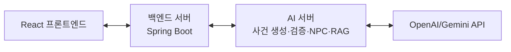
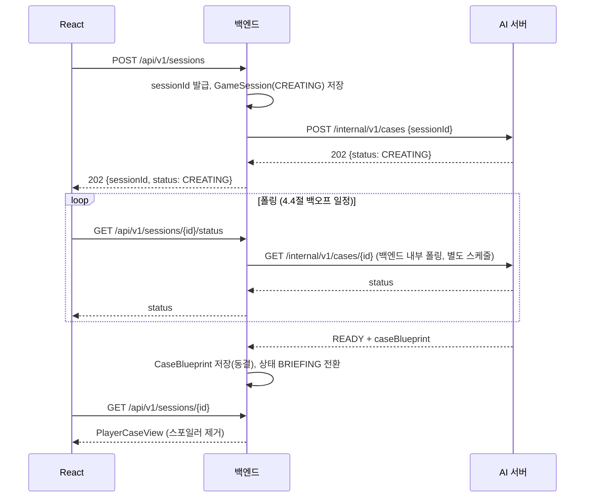

# 아르카디아 스테이션 백엔드 서버 구현 기획서

> 대상 프로젝트: NAN 2026 출품작 「아르카디아 스테이션 사건」
> 이 문서가 다루는 범위: **백엔드 서버(Spring Boot)** — 게임 세션 관리, AI 서버 연동, 프론트엔드(React) 대상 API
> 기술 전제: Spring Boot 4 / Java 21 (2026-07-28: start.spring.io가 Boot 3 스캐폴딩 지원을 중단해 Boot 4로 전환. 아래 본문의 나머지 설명은 Boot 3 기준으로 작성된 원안이며, 계층 구조·API 계약·도메인 모델 등 버전에 의존하지 않는 내용은 그대로 유효함)
> 최종 갱신: 2026-07-28 — AI 서버팀 Q&A(baseline commit d069d7b) 반영

---

## 0. 이 문서를 읽는 방법 (Claude Code 대상)

이 프로젝트는 두 개의 별도 서버로 나뉜다.

| 서버 | 역할 | 구현 주체 |
|---|---|---|
| AI 서버 | 사건(CaseBlueprint) 실시간 생성, 서버 검증, 사건 동결, NPC 대화 생성, RAG 사건기록 검색 | 별도 프로젝트(Codex가 구현) |
| 백엔드 서버 | 게임 세션 생명주기 관리, AI 서버 호출 오케스트레이션, 프론트엔드 공개 API, 탐사/증거/판정 로직 | **이 문서의 구현 대상** |

이 문서는 세 개의 원본 자료를 근거로 구성했다.

1. **Codex 구현 작업서** — AI 서버 쪽에서 자신들이 구현하기 위해 작성한 문서. 사건 생성 파이프라인, LLM 프롬프트 조립, 검증기, RAG 인덱싱, NPC 컨텍스트 팩토리 등 AI 서버 내부 구현 세부사항을 포함한다. **이 내부 구현 세부사항은 백엔드 서버의 작업 범위가 아니므로 이 문서에는 옮기지 않았다.** 대신 프론트엔드 API 초안, 세션 상태 값, `CaseBlueprint` 데이터 구조, 공개/비공개 DTO 분리 원칙, 단서 획득 방식, 최종 추리 판정 로직만 가져와 반영했다.
2. **AI 서버 ↔ 백엔드 게임 시작 계약** — 사건 생성 요청/응답의 확정 계약. 4장에 그대로 반영했다.
3. **AI 서버팀 Q&A + 첨부 스키마(2026-07-28, baseline commit d069d7b)** — NPC/RAG 계약, `case-blueprint.schema.json`, 인증, 배포, 콜드 스타트, 성능·폴링 실측치에 대한 AI 서버팀의 실제 답변. 이걸 반영해서 5·6장은 더 이상 초안이 아니라 확정 계약이 됐고, 3.3절 `CaseBlueprint` 구조도 실제 스키마로 교체했다. 다만 AI 서버 쪽에 아직 남아있는 두 가지 운영상 제약(NPC/RAG 인증 미적용, 세션 데이터 메모리 전용 저장)은 16.2절에 정리했고, 이 제약이 풀리기 전까지 백엔드가 방어적으로 대응해야 하는 부분들을 5.5·6.4·13장에 반영했다.

---

## 1. 전체 아키텍처



- 프론트엔드는 AI 서버를 직접 호출하지 않는다. 항상 백엔드를 거친다.
- 백엔드는 사건의 진실(`CaseBlueprint` 전체)을 저장하지만, 이 중 스포일러가 되는 필드는 프론트에 절대 전달하지 않는다. (10장 참고)
- 백엔드는 LLM을 직접 호출하지 않는다. LLM 호출은 전부 AI 서버 내부에서 일어난다.

## 2. 책임 경계

| 기능 | AI 서버 | 백엔드 서버 |
|---|---|---|
| 사건 아이디어·수법·단서·타임라인 생성 | 담당 | — |
| 생성된 사건의 논리 검증(유일해 판정 등) | 담당 | — |
| 사건 동결 및 폴백 처리 | 담당 | 결과만 수신·저장 |
| 게임 세션 생명주기(상태 전이) | — | 담당 |
| 탐사로 인한 단서 해금 | — | 담당 (블루프린트의 `acquisition` 규칙을 코드로 판정) |
| NPC 대화 생성 | 담당 (세션별 CaseBlueprint 자체 보관) | 프록시 + 응답 재검증 |
| RAG 사건기록 검색·요약 | 담당 | 프록시 + 응답 재검증 |
| 증거 인벤토리 관리 | — | 담당 |
| 최종 추리 제출 판정(범인·역할별 증거) | — | 담당 (LLM 미호출, 결정적 Java 로직) |
| 프론트엔드 공개 데이터 필터링 | — | 담당 |

## 3. 도메인 모델

### 3.1 GameSession

```java
public class GameSession {
    private String sessionId;            // 플레이어(프론트)에게 노출되는 고정 ID. 세션 생성 시 한 번만 발급하고 재시도해도 바뀌지 않는다.
    private String aiCaseRequestId;      // AI 서버 POST /internal/v1/cases 요청에 실제로 실어 보내는 ID. 재시도할 때마다 새로 발급한다 (4.5절 참고).
    private int caseRequestAttemptCount; // aiCaseRequestId를 몇 번째로 새로 발급했는지. 최초 1 + 자동 재시도 최대 2 = 최대 3.
    private SessionState state;
    private String worldTemplateId;
    private String worldTemplateVersion;
    private String ruleTemplateId;
    private String ruleTemplateVersion;
    private String blueprintId;
    private String blueprintSha256;
    private String generationSource;   // "AI" | "FALLBACK"
    private Instant createdAt;
    private Instant frozenAt;
}
```

`sessionId`(프론트가 아는 ID)와 `aiCaseRequestId`(AI 서버가 아는 ID)를 분리한 이유는 4.5절 참고. AI 서버는 같은 `sessionId`로 재요청하면 `409`를 반환하므로, 재시도할 때는 AI 서버 쪽 ID만 새로 발급하고 프론트가 아는 세션 ID는 그대로 유지한다.

주의: AI 서버 자체의 세션 저장소가 아직 메모리 전용이라(16.2절), 백엔드가 `GameSession`을 DB에 안전하게 들고 있어도 AI 서버가 재시작되면 NPC/RAG 호출이 갑자기 `404`를 반환할 수 있다. 이건 백엔드 버그가 아니라 AI 서버 쪽 알려진 제약이므로, `GameSession` 자체에 상태를 더 추가하기보다 13장의 방어적 오류 처리로 대응한다.

### 3.2 SessionState

```text
CREATING       세션 레코드 생성 + AI 서버에 사건 생성 요청 전송 완료
VALIDATING     AI 서버가 검증 진행 중 (AI 서버 status 폴링 결과 그대로 반영)
READY          사건 동결 완료, 아직 브리핑 전
BRIEFING       플레이어에게 브리핑 노출됨
INVESTIGATION  탐사·심문·RAG 질의 진행 중
DEDUCTION      최종 추리 제출 단계
COMPLETED      판정 완료
FAILED         AI 서버 연동 자체가 실패한 경우 (AI 서버의 자체 폴백은 여기 해당 안 됨)
```

주의: AI 서버가 자체 폴백 사건(`generationSource=FALLBACK`)으로 응답해도 그 사건은 검증을 통과한 정상 사건이므로 백엔드 세션 상태는 `READY`로 처리한다. `FAILED`는 백엔드-AI서버 간 통신 자체가 끝내 실패했을 때만 사용한다.

### 3.3 CaseBlueprint (수신 전용 DTO) — `case-blueprint.schema.json` 기준 확정

백엔드는 이 구조를 **생성하지 않는다.** AI 서버 응답을 역직렬화해서 저장하는 용도로만 사용한다. 아래는 AI 서버팀이 공유한 `case-blueprint.schema.json`(JSON Schema Draft 2020-12, 주요 object마다 `additionalProperties: false`)을 그대로 옮긴 것이다. 필드명 하나만 달라도 역직렬화가 실패하니 임의로 이름을 바꾸지 않는다.

```java
public record CaseBlueprint(
    String blueprintId,
    String seed,
    TemplateRef worldTemplate,
    TemplateRef ruleTemplate,
    String culpritId,
    String title,
    String briefing,
    String truthSummary,                    // 비공개
    Method method,                           // 비공개
    List<TimelineEvent> timeline,            // 비공개(발견 전)
    List<Fact> facts,                        // 비공개(발견 전)
    List<Alibi> alibis,                      // 비공개(발견 전)
    List<Clue> clues,                        // 발견한 것만 공개
    List<EvidenceRecord> evidenceRecords,    // RAG는 AI 서버가 대신 검색하므로 백엔드는 원문 보관만
    List<NpcKnowledge> npcKnowledge,         // 비공개
    List<RedHerring> redHerrings,            // resolutionFactIds는 비공개
    Solution solution                         // 완전 비공개
) {}

public record TemplateRef(String id, String version) {}

public record Method(
    String fictionalSummary,
    CaseAction setupAction,
    CaseAction triggerAction,
    String victimCondition
) {}

public record CaseAction(
    String actorId,
    String locationId,
    String systemId,
    String operation,
    List<String> requiredCapabilityIds
) {}

public record TimelineEvent(
    String eventId,
    String time,                      // "HH:mm" 패턴 (정규식 ^([01]\d|2[0-3]):[0-5]\d$)
    List<String> actorIds,
    String locationId,
    TimelineActionType actionType,    // MOVEMENT, SYSTEM_ACTION, CONVERSATION, DISCOVERY, BACKGROUND
    String summary,
    List<String> factIds
) {}

public record Fact(
    String factId,
    FactKind kind,                    // ACTION, MOTIVE, ALIBI, EXCLUSION, CONDITION, CLAIM
    String statement,
    boolean truthValue,
    List<String> subjectCharacterIds
) {}

public record Alibi(
    String characterId,
    String initialClaim,
    String actualWhereabouts,         // 비공개
    List<String> supportingFactIds,
    List<String> contradictingFactIds
) {}

public record Clue(
    String clueId,
    String title,
    ClueType clueType,                // PHYSICAL, DIGITAL, MOTIVE, OPPORTUNITY
    boolean isCore,
    List<EvidenceRole> solutionRoles, // SETUP, TRIGGER, OPPORTUNITY, MOTIVE, VICTIM_CONDITION
    ClueSource source,
    Acquisition acquisition,
    List<String> revealsFactIds,      // 비공개(내부 판정용)
    String playerText,                 // 발견 시 프론트에 노출되는 문구
    List<SuspectEffect> suspectEffects // 비공개(내부 판정용)
) {}

public record ClueSource(String sourceType, String sourceId) {}

public record Acquisition(
    AcquisitionType type,   // EXPLORE, INTERROGATE, RAG_QUERY, CONNECT, AUTO
    String locationId,      // nullable
    String characterId,     // nullable
    List<String> requiredClueIds,
    List<String> queryTopics
) {}

public record SuspectEffect(String characterId, SuspectEffectType effect) {} // SUPPORTS, EXCLUDES, NEUTRAL

public record EvidenceRecord(
    String recordId,
    String recordType,
    String timestamp,
    String title,
    String body,
    Map<String, String> metadata,     // actorId/systemId/operation/locationId/result/characterId/messageType. 스키마는 고정 키 object지만 AI 서버팀 권장대로 Map으로 매핑
    List<String> revealsClueIds,
    List<String> searchTerms,
    RecordVisibility visibility        // SEARCHABLE, HIDDEN
) {}

public record NpcKnowledge(
    String characterId,
    List<String> knownFactIds,
    List<String> initialClaimFactIds,
    List<String> concealedFactIds,     // 완전 비공개
    List<RevealPolicy> revealPolicies,
    List<String> allowedLieFactIds,    // 완전 비공개
    List<String> recommendedQuestionTopics
) {}

public record RevealPolicy(
    String factId,
    List<String> requiredPresentedClueIds,
    ResponseMode responseMode          // DENIAL, EVASION, PARTIAL_ADMISSION, FULL_ADMISSION
) {}

public record RedHerring(
    String redHerringId,
    String suspectId,
    String presentation,
    List<String> resolutionFactIds,    // 비공개
    boolean mustBeResolvable
) {}

public record Solution(
    String culpritId,
    Map<String, List<String>> requiredEvidenceByRole,     // SETUP/TRIGGER/OPPORTUNITY/MOTIVE/VICTIM_CONDITION 5개 키 항상 존재(빈 배열 가능). AI 서버팀 권장대로 Map으로 매핑
    Map<String, List<String>> acceptedAlternativesByRole,
    List<NonCulpritExclusion> nonCulpritExclusions
) {}

public record NonCulpritExclusion(String characterId, List<String> excludedByClueIds, String reason) {}
```

열거형:

```java
public enum EvidenceRole { SETUP, TRIGGER, OPPORTUNITY, MOTIVE, VICTIM_CONDITION }
public enum ClueType { PHYSICAL, DIGITAL, MOTIVE, OPPORTUNITY }
public enum AcquisitionType { EXPLORE, INTERROGATE, RAG_QUERY, CONNECT, AUTO }
public enum SuspectEffectType { SUPPORTS, EXCLUDES, NEUTRAL }
public enum TimelineActionType { MOVEMENT, SYSTEM_ACTION, CONVERSATION, DISCOVERY, BACKGROUND }
public enum FactKind { ACTION, MOTIVE, ALIBI, EXCLUSION, CONDITION, CLAIM }
public enum RecordVisibility { SEARCHABLE, HIDDEN }
public enum ResponseMode { DENIAL, EVASION, PARTIAL_ADMISSION, FULL_ADMISSION }
```

nullable 필드는 `acquisition.locationId`, `acquisition.characterId` 두 개뿐이다(string 또는 null). 나머지는 전부 필수다. 받은 원본 파일 무결성 확인용 SHA-256: 스키마 `0d454426...deca`, 전체 READY 응답 샘플 `911f7af4...81eb`(AI 서버팀 Q&A 문서 3번 항목 전체 값 보관).

### 3.4 EvidenceInventory

```java
public class EvidenceInventory {
    private String sessionId;
    private Set<String> discoveredClueIds;
    private Set<String> revealedFactIds;
    private Set<String> presentedClueIdsByCharacter; // 심문에서 NPC에게 제시한 단서
    private int wrongDeductionAttempts;
}
```

---

## 4. 확정 계약 A — 세션(사건) 생성

이 절은 「AI 서버 ↔ 백엔드 게임 시작 계약」 문서를 그대로 반영한 것이다. 임의로 필드를 바꾸지 말 것.

### 4.1 생성 요청

```http
POST /internal/v1/cases
Content-Type: application/json
X-Internal-AI-Key: <AI_INTERNAL_API_KEY>
```

```json
{
  "sessionId": "game_01K1ARCADIA9J2N7P4Q",
  "seed": "optional-replayable-seed"
}
```

- 이 요청의 `sessionId` 필드에는 백엔드의 `GameSession.aiCaseRequestId`를 넣는다(3.1절). 8~64자, 영문/숫자/`_`/`-`. 프론트가 아는 세션 ID와 반드시 같을 필요는 없다.
- `seed`는 선택. 생략하면 AI 서버가 자체 생성한다. 재현 가능한 리플레이가 필요하면 백엔드가 seed를 저장해뒀다가 넘긴다.
- 같은 ID로 재요청하면 AI 서버가 `409`를 반환한다. 즉 진짜 재시도(새 사건을 다시 만들고 싶은 경우)를 하려면 매번 새 ID를 발급해서 보내야 한다. 자동 재시도 정책은 4.5절 참고.
- `X-Internal-AI-Key`는 특정 기관이 발급하는 토큰이 아니라, 두 서버 운영자가 직접 정해서 AI 서버의 `AI_INTERNAL_API_KEY`와 백엔드의 같은 이름 시크릿에 동일한 값을 넣는 pre-shared secret이다. 현재는 사건 생성/조회(`/internal/v1/cases`) 두 엔드포인트에만 실제로 검사되고, NPC/RAG 엔드포인트에는 아직 적용되지 않는다 — 16.2절 참고. 그래도 백엔드는 세 엔드포인트 모두에 이 헤더를 보내도록 처음부터 구현해서, 나중에 AI 서버가 검사를 붙여도 코드 변경 없이 통과하게 한다.

응답 (`202 Accepted`):

```json
{
  "sessionId": "game_01K1ARCADIA9J2N7P4Q",
  "status": "CREATING",
  "statusUrl": "/internal/v1/cases/game_01K1ARCADIA9J2N7P4Q"
}
```

### 4.2 상태 조회 (폴링)

```http
GET /internal/v1/cases/{sessionId}
X-Internal-AI-Key: <AI_INTERNAL_API_KEY>
```

진행 중:

```json
{
  "sessionId": "game_01K1ARCADIA9J2N7P4Q",
  "status": "VALIDATING",
  "generation": null,
  "errorCode": null
}
```

완료(`READY`)되면 `generation.caseBlueprint`에 3.3절의 전체 구조가 채워져서 온다. 이때 함께 오는 메타데이터(`blueprintSha256`, `generationAttemptCount`, `generationSource`, `model`, `promptVersion`, `createdAt`, `frozenAt`)는 전부 `GameSession`에 저장한다.

### 4.3 백엔드 오류 처리

| 상태 | 의미 | 백엔드 대응 |
|---|---|---|
| `400` | 요청 형식/ID 오류 | 백엔드 버그이므로 로그 남기고 세션 생성 실패 처리 |
| `403` | 내부 API 키 불일치 | 설정 오류. 즉시 알람 |
| `404` | 세션 없음 | 폴링 중 발생하면 안 됨. 발생 시 로그 남기고 재시도 |
| `409` | 중복 요청 ID | 이미 생성 요청이 간 것으로 간주하고 정상 폴링으로 전환 |
| 네트워크 타임아웃 / 5xx | AI 서버 무응답 또는 서버 오류 | 4.5절의 자동 재시도 정책 적용 |

AI 서버 자체의 논리 검증 실패나 모델 거부는 AI 서버가 최대 2회 재시도 후 내부적으로 폴백 사건으로 전환하므로, 백엔드 입장에서는 대부분 `READY`로 끝난다. 즉 백엔드는 "AI가 실패했다"는 상태를 별도로 처리할 필요가 거의 없다 — `READY`만 정상 처리하면 된다. 백엔드가 재시도를 신경 써야 하는 경우는 AI 서버에 요청 자체가 도달하지 못했거나 응답을 못 받은 통신 실패뿐이다.

### 4.4 백엔드 저장 규칙과 폴링 일정 (2026-07-28 실측 반영)

- 완료 응답 원문(JSON)과 `blueprintSha256`을 함께 저장한다.
- 같은 `aiCaseRequestId`로 재생성 요청을 보내 사건을 덮어쓰지 않는다. 정정이 필요하면 4.5절대로 새 `aiCaseRequestId`를 발급한다.
- **폴링 일정은 고정 간격이 아니라 구간별 백오프로 구현한다.** AI 서버팀 실측 기준(사건 하나 생성에 55.39초 걸린 사례 1건, per-attempt timeout 60초, 내부 최대 3회 재시도로 외부 호출 최악 약 180초)을 반영한 값이다.

  | 경과 시간 | 폴링 간격 |
  |---|---|
  | 0~30초 | 2.0초 + 0~300ms 지터 |
  | 30~90초 | 3.0초 + 0~300ms 지터 |
  | 90~210초 | 5.0초 + 0~300ms 지터 |
  | 210초 초과 | 폴링 중단, 마지막 상태 한 번 더 확인 후 타임아웃 처리 + 운영 로그 기록 |

  지터를 두는 이유는 여러 세션이 동시에 생성될 때 폴링 트래픽이 한 번에 몰리는 걸 피하기 위해서다. `GET /internal/v1/cases/{sessionId}`에는 현재 호출 빈도 제한이 없다고 확인했지만, 그렇다고 무작정 빠르게 돌 필요는 없다.
- Spring의 `TaskScheduler` 또는 `@Scheduled` 기반 워커, 혹은 `WebClient`의 재시도(backoff)로 구현. 프론트에는 백엔드 자체의 `GET /api/v1/sessions/{id}/status`(7장)로 상태를 노출하고, 프론트가 그걸 폴링한다 — 즉 폴링이 두 겹(백엔드→AI서버, 프론트→백엔드)으로 존재한다. **프론트-백엔드 구간은 SSE/웹소켓이 아니라 폴링으로 확정.**
- `CREATING`/`VALIDATING` 상태에서는 `generation`이 `null`이다. `READY`에서만 전체 `generation`이 채워진다. `generationSource=FALLBACK`도 정상 `READY`이므로 실패로 취급하지 않고 같은 방식으로 저장한다.

### 4.5 세션 생성 자동 재시도 정책 (확정)

AI 서버로의 통신 자체가 실패(타임아웃, 5xx, 연결 실패)하면 다음 순서로 처리한다.

1. 최초 요청이 실패하면 `caseRequestAttemptCount`를 1 증가시키고, 새 `aiCaseRequestId`를 발급해서 4.1의 생성 요청을 다시 보낸다. 프론트가 아는 `sessionId`는 그대로 둔다.
2. 이 자동 재시도는 최대 2회까지 허용한다 (즉 최초 시도 1회 + 자동 재시도 2회 = 최대 3회 시도).
3. 3회 모두 실패하면 그 시점에 세션 상태를 `FAILED`로 확정하고, 더 이상 자동 재시도하지 않는다.
4. `FAILED` 확정 시 프론트에는 `GET /api/v1/sessions/{id}/status`를 통해 `FAILED` 상태를 그대로 전달한다. 프론트가 재시도 버튼을 보여줄지, 새 세션 생성을 다시 유도할지는 프론트 쪽 UX 결정 사항이며 백엔드는 상태만 정확히 전달하면 된다.
5. 재시도 간 대기 시간은 지수 백오프(예: 1초 → 3초)를 권장하되, 총 소요 시간이 12장의 `case-generation.connect-timeout`을 과도하게 넘기지 않도록 상한을 둔다.

이 정책은 AI 서버 자체 내부 로직(최대 2회 논리 검증 재시도 후 폴백)과는 완전히 별개다. AI 서버 내부 재시도는 AI 서버가 알아서 처리하고 백엔드에는 `READY`로만 보이며, 4.5절의 재시도는 그 요청 자체가 AI 서버에 도달·응답하지 못했을 때만 발동한다.

---

## 5. NPC 심문 프록시 — 확정 (운영상 제약 있음)

### 5.1 배경

플레이어가 NPC에게 질문하거나 증거를 제시하면, 프론트 → 백엔드 → AI 서버 → 백엔드 → 프론트 순으로 흐른다. AI 서버가 사건 생성 완료 시점에 `FrozenCaseBlueprint`, 발견 단서 목록, RAG 인덱스를 세션별로 자체 보관하기 때문에, 백엔드는 매 요청마다 허용된 사실 목록 같은 내부 컨텍스트를 조립해서 보낼 필요가 없다. 대신 백엔드가 반드시 해야 하는 일은 다음과 같다.

- 플레이어가 지금까지 발견한 단서(`EvidenceInventory.discoveredClueIds`) 기준으로 `presentedClueIds`가 유효한지 사전 확인 (미발견 단서를 보내면 AI 서버가 400을 준다)
- AI 서버가 응답으로 준 `revealedFactIds`가 실제로 공개 허용된 사실인지 화이트리스트로 재검증 — **AI 서버 응답을 그대로 믿지 않는다.**
- 검증 실패 시 사실 공개 없이 안전한 응답으로 대체

### 5.2 요청

```http
POST {AI_SERVER_BASE_URL}/api/v1/sessions/{sessionId}/interrogations/{characterId}/turns
Content-Type: application/json
```

```json
{
  "question": "안전 점검 기록을 설명해 주세요.",
  "presentedClueIds": ["CLUE-SETUP-PANEL", "CLUE-TRIGGER-LOG"]
}
```

| 필드 | 타입 | 설명 |
|---|---|---|
| `question` | string, 필수 | 플레이어 질문. 공백 불가 |
| `presentedClueIds` | string[], 필수 | 이번 턴에 NPC에게 제시하는 단서 ID. 이 세션에서 이미 발견된 단서만 허용 |

이 경로는 백엔드가 프론트에 노출하는 `/api/v1/sessions/{id}/interrogations/{characterId}/turns`(7장)와 우연히 같은 모양이지만, 이건 AI 서버 자신의 경로다. `InterrogationClient`는 `AI_SERVER_BASE_URL` + 이 경로를 호출하는 것이지 백엔드 자기 자신을 호출하는 게 아니다.

### 5.3 응답

```json
{
  "dialogue": "그 기록이 있다면 일부는 인정하죠. 사건 전 소피아 인증으로 의료 안전 점검 예약이 등록됐습니다.",
  "emotion": "DEFENSIVE",
  "revealedFactIds": ["FACT-SETUP"],
  "recommendedQuestions": [
    {"topicId": "TOPIC-1", "label": "안전 점검 예약의 목적"},
    {"topicId": "TOPIC-2", "label": "02:05 진단 실행 시각"}
  ]
}
```

| 필드 | 타입 | 설명 |
|---|---|---|
| `dialogue` | string | NPC 대사 |
| `emotion` | enum | `CALM` / `DEFENSIVE` / `ANXIOUS` / `ANGRY` / `EVASIVE` |
| `revealedFactIds` | string[] | AI 서버가 계산한 공개 가능 사실의 부분집합 |
| `recommendedQuestions` | object[2] | 각 항목 `topicId`, `label` |

백엔드가 반드시 재검증할 것:

- `revealedFactIds` ⊆ 해당 세션·NPC의 `npcKnowledge`에서 공개 가능한 사실 집합
- 검증 실패 시 `dialogue`만 노출하고 `revealedFactIds`는 빈 배열로 덮어써서 프론트에 전달 (사실 유출 방지)

### 5.4 오류

| HTTP | code | 조건 |
|---|---|---|
| 400 | `INVALID_REQUEST` | 빈 질문, 존재하지 않는 `characterId`, 미발견 단서 제시 |
| 404 | `SESSION_NOT_FOUND` | AI 서버 메모리에 해당 `sessionId`가 없음 — 5.5절 참고 |
| 409 | `SESSION_NOT_READY` | `CaseBlueprint` 동결 전 호출 |
| 409 | `INVALID_SESSION_STATE` | 세션 상태 전이 위반 |

### 5.5 운영상 제약 (2026-07-28 기준, 스테이징 전 P0)

- **인증 미적용** — 이 엔드포인트는 현재 `X-Internal-AI-Key`를 검사하지 않는다. 백엔드는 그래도 처음부터 헤더를 보내도록 구현해둔다.
- **세션 데이터가 메모리 전용** — AI 서버는 `ConcurrentHashMap` 기반 `InMemoryGameSessionRepository`를 쓴다. AI 서버가 재시작·재배포·콜드 스타트되면 그 세션의 `CaseBlueprint`/발견 단서/RAG 인덱스가 전부 사라지고, 이후 호출은 전부 `404 SESSION_NOT_FOUND`가 된다. 현재 AI 서버 쪽에 세션을 다시 주입하는 API가 없다. 백엔드는 이 상황을 감지해서 "일시적으로 심문할 수 없습니다, 잠시 후 다시 시도해주세요" 같은 우아한 실패로 처리해야 한다 — 게임 전체를 죽이면 안 된다(13장). 공모전 데모 도중 AI 서버가 재배포되면 실제로 벌어질 수 있는 상황이니, 데모 직전에는 AI 서버 쪽 배포 계획이 없는지 확인해두는 게 안전하다.

---

## 6. RAG 사건기록 검색 프록시 — 확정 (운영상 제약 있음)

### 6.1 요청

```http
POST {AI_SERVER_BASE_URL}/api/v1/sessions/{sessionId}/assistant/queries
Content-Type: application/json
```

```json
{
  "question": "02:05 소피아 안전 진단 기록을 보여줘"
}
```

### 6.2 응답

```json
{
  "answer": "02:05 의료 안전 진단 실행 기록: 02:05 생명 유지 시스템에서 의료 안전 진단이 실행됐다...",
  "citedRecordIds": ["RECORD-TRIGGER"],
  "suggestedQueries": [
    "02:05 관련 기록을 더 보여줘",
    "소피아 관련 기록을 더 보여줘"
  ],
  "newlyDiscoveredClues": [
    {
      "clueId": "CLUE-TRIGGER-LOG",
      "title": "02:05 안전 진단 감사 로그",
      "clueType": "DIGITAL",
      "solutionRoles": ["TRIGGER"],
      "playerText": "02:05에 소피아의 인증으로 의료 안전 진단 작업이 실행됐다."
    }
  ]
}
```

| 필드 | 타입 | 설명 |
|---|---|---|
| `answer` | string | 검색된 확정 기록만 사용한 요약 |
| `citedRecordIds` | string[] | 이 응답의 근거가 된 `EvidenceRecord` ID |
| `suggestedQueries` | string[] | 후속 검색어. AI 서버 스키마상 2개 고정 |
| `newlyDiscoveredClues` | 객체[] | 이 검색으로 새로 획득한 공개 단서 — `clueId`/`title`/`clueType`/`solutionRoles`/`playerText` |

이전 초안과 달리, RAG 응답은 `citedRecordIds`로 기존 기록을 인용할 뿐 아니라 `newlyDiscoveredClues`로 **단서 자체를 직접 해금**할 수 있다는 게 확정됐다. `acquisition.type == "RAG_QUERY"`인 단서가 이 경로로 열리는 구조다.

백엔드가 반드시 재검증할 것:

- `citedRecordIds`가 실제로 이 세션의 `evidenceRecords`에 존재하는 ID인지
- `newlyDiscoveredClues[].clueId`가 실제로 이 세션의 `CaseBlueprint.clues`에 등록돼 있고 그 단서의 `acquisition.type`이 `RAG_QUERY`인지 — 등록되지 않은 `clueId`가 오면 무시하고 로그만 남긴다
- 검증을 통과한 단서만 `EvidenceInventory.discoveredClueIds`에 추가

### 6.3 오류

5.4절과 동일한 오류 체계를 공유한다 (`INVALID_REQUEST` / `SESSION_NOT_FOUND` / `SESSION_NOT_READY` / `INVALID_SESSION_STATE`).

### 6.4 운영상 제약

5.5절과 동일하다 — 인증 미적용, 세션 메모리 전용 저장으로 인한 `404` 리스크. 대응 방식도 동일하게 적용한다.

---

## 7. 프론트엔드 공개 API

프론트는 아래 엔드포인트로만 백엔드와 통신한다. AI 서버 존재 자체를 알 필요가 없다.

| Method | Path | 역할 |
|---|---|---|
| `POST` | `/api/v1/sessions` | 새 세션 생성 + AI 서버에 사건 생성 요청 시작 |
| `GET` | `/api/v1/sessions/{id}/status` | 생성 중/준비 완료/실패 상태 조회 (프론트 폴링용) |
| `GET` | `/api/v1/sessions/{id}` | 현재 플레이어 공개 상태 조회 (`PlayerCaseView`) |
| `POST` | `/api/v1/sessions/{id}/explore` | 장소·오브젝트 조사 |
| `POST` | `/api/v1/sessions/{id}/interrogations/{characterId}/turns` | NPC 질문/증거 제시 (내부적으로 5장 프록시) |
| `POST` | `/api/v1/sessions/{id}/assistant/queries` | 사건 기록 검색 (내부적으로 6장 프록시) |
| `POST` | `/api/v1/sessions/{id}/deductions` | 최종 수사 보고서 제출 |
| `GET` | `/api/v1/sessions/{id}/result` | 판정 후 사건 재구성 조회 |

`POST /api/v1/sessions`도 즉시 `202 Accepted` + `sessionId`를 반환하고, 실제 사건 생성은 백그라운드에서 4장의 흐름대로 진행한다.

참고: AI 서버의 NPC/RAG 경로(5·6장)도 `/api/v1/sessions/{sessionId}/...` 모양을 쓴다. 이건 우연히 같은 패턴일 뿐 서로 다른 서버의 경로다 — 프론트는 위 표의 백엔드 경로만 호출하고, 백엔드 내부에서 `InterrogationClient`/`AssistantClient`가 `AI_SERVER_BASE_URL` 기준으로 AI 서버 경로를 별도로 호출한다.

### 7.1 세션 생성 시퀀스



---

## 8. 탐사(Explore) 처리 로직

```http
POST /api/v1/sessions/{id}/explore
```

```json
{ "locationId": "LIFE_SUPPORT_CORRIDOR", "objectHint": "optional" }
```

처리 순서:

1. 세션이 `INVESTIGATION` 상태인지 확인
2. 저장된 `CaseBlueprint.clues`에서 `acquisition.type == "EXPLORE"` 이고 `acquisition.locationId`가 요청한 장소와 일치하는 단서를 찾는다
3. `acquisition.requiredClueIds`가 이미 `EvidenceInventory.discoveredClueIds`에 전부 포함되는지 확인 (선행 조건)
4. 조건을 만족하면 해당 단서를 `discoveredClueIds`에 추가하고 `revealsFactIds`를 `revealedFactIds`에 반영
5. `CONNECT` 타입 단서는 매 해금 이벤트 이후 "지금 보유한 단서 조합으로 새로 열리는 CONNECT 단서가 있는지" 재검사 (연쇄 해금)
6. 응답에는 새로 얻은 단서의 `playerText`만 내려준다. `revealsFactIds`, `suspectEffects` 같은 내부 판정용 필드는 내려주지 않는다

`acquisition.type == "RAG_QUERY"`인 단서는 여기서 해금되지 않는다 — 6장의 RAG 응답 `newlyDiscoveredClues`를 통해서만 해금된다.

```java
public interface ClueUnlockService {
    List<Clue> exploreLocation(String sessionId, String locationId);
    List<Clue> resolveConnectClues(String sessionId); // 5단계에서 사용
}
```

---

## 9. 최종 추리 판정 (Deduction)

LLM을 호출하지 않는다. 백엔드가 순수 Java 규칙으로 판정한다.

### 9.1 요청

```json
{
  "culpritId": "SOPHIA",
  "evidenceByRole": {
    "SETUP": "CLUE-SETUP-LOG",
    "TRIGGER": "CLUE-TRIGGER-TRACE",
    "OPPORTUNITY": "CLUE-ACCESS-HISTORY",
    "MOTIVE": "CLUE-MOTIVE-MESSAGE"
  }
}
```

### 9.2 판정 규칙

- 제출한 모든 `clueId`가 `EvidenceInventory.discoveredClueIds`에 실제로 있는지 확인 (미획득 단서로 제출 불가)
- 각 단서가 해당 역할(`solutionRole`)로 등록되어 있는지 확인
- `culpritId`가 `CaseBlueprint.solution.culpritId`와 일치하는지 확인
- 필수 역할(`SETUP`/`TRIGGER`/`OPPORTUNITY`/`MOTIVE`)이 모두 채워졌는지 확인
- `solution.acceptedAlternativesByRole`에 등록된 대체 단서도 정답으로 인정
- `wrongDeductionAttempts`를 증가시키고 12장 설정값의 `arcadia.game.deduction.max-wrong-submissions`(기본 3회) 초과 시 더 이상 제출 불가 처리 — 이 값은 `CaseBlueprint`가 아니라 백엔드 자체 게임 규칙이다

### 9.3 응답

```json
{
  "verdict": "PARTIAL",
  "culpritCorrect": true,
  "roleResults": {
    "SETUP": "CORRECT",
    "TRIGGER": "CORRECT",
    "OPPORTUNITY": "INCORRECT",
    "MOTIVE": "CORRECT"
  },
  "remainingAttempts": 2,
  "feedback": "범인은 맞지만 기회와 권한을 입증하는 증거를 다시 확인해야 합니다."
}
```

`feedback`은 결과 코드 조합에 따라 백엔드가 미리 정의한 문구 템플릿으로 조립한다. 오답 상태에서 정답 단서 ID나 아직 찾지 못한 사실을 절대 노출하지 않는다. 전체 정답(`verdict == "CORRECT"`)이면 세션 상태를 `COMPLETED`로 전환하고 `GET /result`에서 `FinalCaseReveal`(전체 진실 재구성)을 공개한다.

---

## 10. 데이터 공개 경계 (보안)

프론트로 나가는 모든 응답 DTO는 다음 필드를 절대 포함하면 안 된다. (세션이 `COMPLETED` 상태가 되어 `GET /result`를 호출하기 전까지)

- `culpritId`
- `truthSummary`
- `method` (전체)
- 각 인물의 `actualWhereabouts`
- 아직 발견하지 않은 `clues`
- `solution` 전체
- `npcKnowledge.concealedFactIds`, `npcKnowledge.allowedLieFactIds`
- `redHerrings.resolutionFactIds`
- 검색·인용되지 않은 `evidenceRecords`의 원문(`body`), 특히 `visibility == "HIDDEN"`인 기록

구현 시 아래처럼 응답 전용 DTO를 명확히 분리하고, `CaseBlueprint`(백엔드 내부 전용)를 직접 직렬화해서 컨트롤러 밖으로 내보내는 코드가 없는지 점검한다.

```text
CaseBlueprint      (내부 전용, 절대 컨트롤러 응답으로 직접 반환 금지)
PlayerCaseView     (브리핑 + 획득한 단서만)
DeductionResult    (판정 결과, 정답 단서 ID는 노출 안 함)
FinalCaseReveal     (COMPLETED 이후에만 전체 공개)
```

권장: 직렬화 테스트를 작성해서 `PlayerCaseView` JSON에 `culpritId`, `solution` 같은 키가 절대 나타나지 않는지 회귀 테스트로 고정한다.

---

## 11. 패키지 구조

문서1(Codex 작업서)의 `domain`/`application`/`api` 구조는 AI 서버 쪽 컨벤션이다. 백엔드는 그걸 따라갈 필요 없이 기존에 쓰던 계층형(controller/service/dto) 구조를 그대로 쓴다. 아래는 그 구조에 맞춘 제안이며, 이미 레포에 컨벤션이 있으면 당연히 그걸 우선한다(15장 1단계).

```text
com.arcadia.station
├─ controller
│  ├─ GameSessionController        // 세션 생성/조회/상태 (7장)
│  ├─ ExplorationController        // 8장
│  ├─ InterrogationController      // 5장 (프록시)
│  ├─ AssistantController          // 6장 (프록시)
│  └─ DeductionController          // 9장
├─ service
│  ├─ GameSessionService           // 세션 생성·상태 전이, 4.5절 재시도 정책
│  ├─ ExplorationService
│  ├─ InterrogationProxyService
│  ├─ AssistantProxyService
│  └─ DeductionService
├─ dto
│  ├─ request
│  │  ├─ SessionCreateRequest
│  │  ├─ ExploreRequest
│  │  ├─ InterrogationTurnRequest
│  │  ├─ AssistantQueryRequest
│  │  └─ DeductionRequest
│  └─ response
│     ├─ PlayerCaseView
│     ├─ DeductionResult
│     └─ FinalCaseReveal
├─ domain
│  ├─ GameSession
│  ├─ SessionState
│  ├─ EvidenceInventory
│  └─ caseblueprint
│     └─ CaseBlueprint (및 하위 record들 — 3.3절)
├─ repository
│  ├─ GameSessionRepository
│  └─ EvidenceInventoryRepository
├─ client                            // AI 서버 연동 게이트웨이
│  ├─ CaseGenerationClient           // 4장 계약 호출
│  ├─ InterrogationClient            // 5장 계약 호출
│  ├─ AssistantClient                // 6장 계약 호출
│  └─ dto                            // AI 서버와 주고받는 요청/응답 전용 DTO
├─ config
│  └─ AiServerProperties             // X-Internal-AI-Key, timeout 등 (12장)
├─ scheduler
│  └─ KeepAliveScheduler             // 12.2절 — 공모전 심사 기간 콜드 스타트 방지
├─ exception
│  ├─ BusinessException
│  └─ ErrorCode
└─ common
   └─ ApiResponse<T>                 // success/message/data 래핑
```

`client` 패키지는 인터페이스로 분리해서, AI 서버 쪽 5.5·6.4절 제약(인증 미적용, 메모리 전용 저장)이 풀려도 구현체만 손보면 되도록 설계한다.

```java
public interface CaseGenerationClient {
    CaseGenerationAck requestCase(String aiCaseRequestId, String seed);
    CaseGenerationStatus pollStatus(String aiCaseRequestId);
}

public interface InterrogationClient {
    NpcTurnResult ask(String sessionId, String characterId, String question, List<String> presentedClueIds);
}

public interface AssistantClient {
    AssistantQueryResult query(String sessionId, String question);
}
```

`CaseGenerationClient`는 3.1·4.5절에서 정의한 `aiCaseRequestId`(재시도마다 새로 발급되는 AI 서버용 ID)를 받는다. `InterrogationClient`/`AssistantClient`는 5·6장의 확정된 필드로 맞췄다. 다만 AI 서버 쪽 인증 미적용·세션 메모리 저장 문제(5.5·6.4절)가 남아있으니, 구현체는 `404 SESSION_NOT_FOUND`를 별도로 잡아서 13장의 우아한 실패 처리로 연결한다.

---

## 12. 설정값

```yaml
server:
  port: ${PORT:8080}   # Render는 동적 포트를 $PORT로 주입한다. 반드시 바인딩해야 배포가 성공한다.

spring:
  datasource:
    url: jdbc:postgresql://${DB_HOST}:${DB_PORT}/${DB_NAME}
    username: ${DB_USERNAME}
    password: ${DB_PASSWORD}
    driver-class-name: org.postgresql.Driver
  jpa:
    hibernate:
      ddl-auto: update      # 해커톤 단계 임시값. 안정화되면 Flyway 등 마이그레이션 도구로 전환 권장
    open-in-view: false

arcadia:
  ai-server:
    base-url: ${AI_SERVER_BASE_URL}
    internal-api-key: ${AI_INTERNAL_API_KEY}
    case-generation:
      connect-timeout: 10s        # POST /internal/v1/cases 자체는 빠르게 202를 준다
      per-attempt-timeout: 60s    # AI 서버 실측: 큰 사건 구조화 응답 55.39초. AI_CASE_GENERATION_TIMEOUT과 동일 값
      poll-total-budget: 210s     # 4.4절 백오프 일정의 총 상한
      max-auto-retry: 2           # 4.5절 — 백엔드-AI서버 통신 실패 시의 재시도. AI 서버 내부 재시도(최대 2회)와는 별개
    interrogation:
      timeout: 65s   # 목표 SLA는 10~12초지만, AI 서버가 아직 목적별 타임아웃을 분리하지 않아 사건생성용 60초 read timeout을 공유한다(16.2절, P1). 분리되면 12s로 낮춘다
    assistant:
      timeout: 65s   # 위와 동일한 이유
  game:
    deduction:
      max-wrong-submissions: 3
```

`DB_HOST`/`DB_PORT`/`DB_NAME`/`DB_USERNAME`/`DB_PASSWORD`는 Render Postgres 인스턴스의 "Connect" 탭에 나오는 값을 그대로 백엔드 웹 서비스의 환경변수로 등록한다. Render는 하나로 합쳐진 연결 문자열(Internal Database URL)도 주지만, Spring `datasource.url`은 JDBC 형식(`jdbc:postgresql://...`)을 기대하므로 위처럼 필드를 나눠 받는 쪽이 파싱 코드 없이 더 간단하다.

`AI_INTERNAL_API_KEY`는 환경 변수/시크릿 저장소에서만 읽는다. 로그나 예외 메시지에 남기지 않는다. staging/production처럼 환경이 나뉘면 서로 다른 32바이트 이상 랜덤 키를 쓰고 Render Environment Group 같은 시크릿 저장소에 보관하는 걸 권장한다(AI 서버팀도 같은 권장안을 갖고 있다).

### 12.1 배포 환경 참고 — Render

이 프로젝트는 Render에 배포할 예정이다. 배포 방식이 DB 사용 여부와 타임아웃 설계에 직접 영향을 주므로 여기 반영해둔다.

- Render 무료 웹 서비스는 15분간 요청이 없으면 프로세스(JVM) 자체가 슬립 상태로 들어가고, 다음 요청이 오면 콜드 스타트로 새로 기동된다. 즉 인메모리(`ConcurrentHashMap`) 방식으로 `GameSession`/`EvidenceInventory`를 들고 있으면, 플레이어가 브리핑을 읽거나 고민하는 사이에 15분만 지나도 진행 상황이 통째로 날아갈 수 있다. 그래서 3장 도메인 모델은 DB(JPA) 저장을 전제로 설계했다 — 이건 취향 문제가 아니라 Render 무료 티어의 슬립 동작 때문에 사실상 필요한 선택이다. (참고로 AI 서버도 정확히 같은 이유로 세션 영속화가 P0 항목이다 — 16.2절.)
- DB 연결 자체는 추가 작업이랄 게 거의 없다. Render 대시보드에서 PostgreSQL 인스턴스를 만들고 발급되는 Internal Database URL을 웹 서비스 환경변수로 넣기만 하면 되고, Spring 쪽은 기존에 쓰던 JPA `datasource` 설정 그대로 쓰면 된다. 이전에 AWS RDS + EC2로 했던 구성(보안그룹, VPC, TLS 수동 설정 등)보다 오히려 간단하다.
- 진짜 신경 써야 할 부분은 따로 있다 — Render 무료 PostgreSQL은 생성 후 30일이 지나면 자동 삭제된다. NAN 2026 데모/제출 일정이 30일을 넘긴다면, 무료로 시작했다가 만료 직전에 유료 전환하거나 새 인스턴스로 옮기는 게 오히려 더 큰 추가 작업이 되므로 처음부터 유료 인스턴스(Basic 등급, 월 6~7달러대)로 시작하는 걸 권장한다.
- 콜드 스타트가 데모 경험에 영향을 준다면(요청 시 수십 초 지연) 웹 서비스도 무료 대신 유료(Starter, 월 7달러대)를 고려한다.
- AI 서버팀이 권장하는 자체 토폴로지는 같은 Render workspace·region에 백엔드는 Web Service로, AI 서버는 Private Service로 두고 사설망(Private Network)으로 통신하는 것이다. Private Service는 Free Web Service의 15분 유휴 슬립 대상이 아니다. 다만 Free Web Service는 사설망 요청을 보낼 수는 있어도 받을 수는 없으므로, 이 토폴로지가 성립하려면 AI 서버가 Free Web Service가 아니라 Private Service 타입이어야 한다 — 이건 AI 서버팀의 배포 선택이지 백엔드가 결정할 부분은 아니지만, `AI_SERVER_BASE_URL`이 public URL이 될지 private hostname이 될지에 영향을 준다. 현재(2026-07-28) AI 서버는 아직 어디에도 배포되지 않았고, 로컬 주소(`http://127.0.0.1:8081`)만 확정돼 있다. 실제 staging/production URL은 AI 서버팀이 서비스 생성 후 공유하기로 했다 — 16.2절 참고.

### 12.2 콜드 스타트 방지 — 공모전 심사 기간용 Keep-Alive 스케줄러

무료 웹 서비스를 그대로 쓰면서 심사위원이 접속하는 순간에는 콜드 스타트를 겪지 않게 하려면, 심사 기간 동안만 백엔드가 주기적으로 자기 자신에게 요청을 보내 슬립에 들어가지 않게 한다. 이 스케줄러는 백엔드 자기 자신의 슬립만 막는다 — AI 서버가 Private Service로 배포된다면 애초에 이 슬립 문제 자체가 없다(위 12.1절).

핵심 주의점: 이 핑은 반드시 실제로 바깥에 나갔다가 다시 들어오는 HTTP 요청이어야 한다. Render의 슬립 판단은 그 서비스의 공개 엔드포인트로 들어오는 요청을 기준으로 하므로, 내부 메서드를 직접 호출하거나 `localhost`로 호출하면 슬립을 막지 못한다. 배포된 공개 URL(`https://xxx.onrender.com`)로 나가야 한다. Render는 실행 중인 웹 서비스에 `RENDER_EXTERNAL_URL` 환경변수를 자동으로 넣어주므로 이 값을 그대로 핑 대상으로 쓰면 URL을 하드코딩하지 않아도 된다.

```java
@Component
@ConditionalOnProperty(prefix = "arcadia.keep-alive", name = "enabled", havingValue = "true")
public class KeepAliveScheduler {

    private static final Logger log = LoggerFactory.getLogger(KeepAliveScheduler.class);

    private final RestClient restClient = RestClient.create();
    private final String targetUrl;

    public KeepAliveScheduler(@Value("${arcadia.keep-alive.target-url}") String targetUrl) {
        this.targetUrl = targetUrl;
    }

    @Scheduled(fixedRate = 600_000) // 10분마다 — Render의 15분 슬립 기준보다 여유를 둔 값
    public void ping() {
        try {
            restClient.get()
                .uri(targetUrl + "/actuator/health")
                .retrieve()
                .toBodilessEntity();
        } catch (Exception e) {
            log.warn("keep-alive ping 실패: {}", e.getMessage());
        }
    }
}
```

`@EnableScheduling`을 별도 설정 클래스에 추가해야 스케줄러가 동작한다. 설정값:

```yaml
arcadia:
  keep-alive:
    enabled: ${KEEP_ALIVE_ENABLED:false}
    target-url: ${RENDER_EXTERNAL_URL:http://localhost:8080}
```

- `KEEP_ALIVE_ENABLED`는 평소엔 `false`로 꺼두고, 공모전 심사/테스트 기간에만 Render 대시보드에서 `true`로 바꿔 켠다. 코드를 다시 배포할 필요 없이 환경변수만 바꾸면 된다.
- 헬스체크 엔드포인트는 `spring-boot-starter-actuator`의 `/actuator/health`를 그대로 쓴다. Render 서비스 설정의 "Health Check Path"도 같은 경로로 맞춰두면 배포 시 자체 헬스체크와도 일치한다.
- 10분 주기는 네트워크 지연이나 스케줄 지터를 감안해도 15분 슬립 기준 안에 안전하게 들어오는 값이다.
- 이 핑은 웹 서비스 슬립만 막는다. DB는 활동량과 무관하게 30일 뒤 만료되는 것이라(12.1절) keep-alive와는 별개로 유료 전환 여부를 챙겨야 한다.
- Render 무료 티어는 워크스페이스당 월 750 free instance hours를 준다. 이 백엔드 하나만 한 달 내내 깨워둬도 약 744시간이라 한도 안에 들어오지만, 같은 워크스페이스에 다른 무료 서비스를 더 띄울 계획이면 합산 한도를 넘지 않는지 확인한다.

---

## 13. 오류 처리 및 장애 대응

- 세션 생성 요청이 AI 서버와 통신 자체에 실패하면 4.5절의 정책대로 최대 2회 자동 재시도하고, 그래도 실패하면 세션을 `FAILED`로 확정한다. 프론트에는 "잠시 후 다시 시도해주세요" 수준의 일반 오류만 노출하고 사건 내용은 당연히 노출하지 않는다(애초에 없다).
- NPC/RAG 프록시 호출이 `404 SESSION_NOT_FOUND`를 반환하면(5.5·6.4절 — AI 서버가 재시작되어 세션 메모리를 잃은 경우), 게임을 중단시키지 않고 "일시적으로 이용할 수 없습니다" 수준의 메시지로 응답한다. 이 세션에는 내부적으로 `AI_SESSION_LOST` 같은 플래그를 남겨 운영 로그로 추적한다. AI 서버팀이 세션 영속화(16.2절 P0)를 완료하기 전까지는 실제로 발생할 수 있는 상황이므로 반드시 처리해둔다.
- NPC/RAG 호출이 실패(위 404 포함)하면 게임 진행 자체를 막지 않는다. 서버가 들고 있는 고정 안전 응답(예: "지금은 대답할 수 없습니다")과, 백엔드가 미리 계산해둔 추천 질문 후보 중 일부를 대신 반환한다.
- 임베딩/RAG 관련 실패가 AI 서버 쪽에서만 발생한 경우는 AI 서버 책임이므로 백엔드는 해당 세션의 검색 기능만 일시적으로 저하됐다고 보고 게임을 중단시키지 않는다.
- 현재 AI 서버의 NPC/RAG 호출은 목적별 타임아웃이 분리돼 있지 않아 최악의 경우 60초까지 걸릴 수 있다(12장, 16.2절). 백엔드 쪽 HTTP client 타임아웃을 65초로 여유 있게 잡아둔 이유이며, 이 상태에서 프론트가 너무 오래 기다리지 않도록 로딩 UI/타임아웃 메시지를 프론트 쪽에서도 별도로 고려하는 게 좋다.

---

## 14. 테스트 요구사항

### 14.1 단위 테스트

- `GameSessionServiceTest` — 상태 전이 규칙
- `ClueUnlockServiceTest` — EXPLORE/CONNECT/AUTO 해금 로직
- `DeductionServiceTest` — 정답/부분정답/오답 판정
- `NpcTurnGuardTest` — `revealedFactIds` 화이트리스트 재검증 로직 (5.3)
- `AssistantResultGuardTest` — `citedRecordIds`/`newlyDiscoveredClues` 화이트리스트 재검증 로직 (6.2)
- `PlayerCaseViewSerializationTest` — 비공개 필드 유출 회귀 테스트

### 14.2 통합 테스트 (Fake AI 서버 클라이언트 사용)

```text
세션 생성 → Fake CaseGenerationClient가 검증 완료된 CaseBlueprint 반환
→ 세션 READY/BRIEFING 전환
→ 탐사로 물리 단서 획득
→ Fake AssistantClient로 디지털 단서 획득 (newlyDiscoveredClues 포함)
→ Fake InterrogationClient로 NPC 사실 일부 공개
→ 네 개 역할 증거로 최종 보고서 제출 → COMPLETED
→ GET /result로 전체 재구성 공개 확인
```

실패 흐름도 함께 테스트한다: AI 서버 타임아웃, 잘못된 `revealedFactIds` 반환(화이트리스트 밖), 잘못된 `citedRecordIds`/`newlyDiscoveredClues` 반환, 미획득 단서로 판정 제출 시도, 오답 3회 초과 제출 시도, `InterrogationClient`/`AssistantClient`가 `404 SESSION_NOT_FOUND`를 받았을 때 13장의 우아한 실패로 정확히 변환되는지.

---

## 15. 구현 순서

1. **저장소 파악** — 기존 코드/컨벤션이 있으면 그것을 우선하고, 이 문서의 도메인 계약과 보안 경계(10장)만 유지한다.
2. **도메인 계약** — `GameSession`, `SessionState`, `EvidenceInventory`, `CaseBlueprint` 및 하위 record를 3.3절(`case-blueprint.schema.json` 기준)에 맞춰 작성. Jackson 역직렬화 테스트 포함.
3. **AI 서버 연동 클라이언트(Fake 버전 먼저)** — `CaseGenerationClient`/`InterrogationClient`/`AssistantClient` 인터페이스 정의 + Fake 구현체로 전체 플로우를 먼저 완주시킨다.
4. **세션 생성 수직 절단** — `POST /api/v1/sessions` → Fake 클라이언트 → `READY` → `PlayerCaseView` 노출까지.
5. **탐사/증거 인벤토리** — 8장.
6. **NPC/RAG 프록시(5·6장 확정 계약 기준)** — 404 SESSION_NOT_FOUND 등 13장의 방어적 처리를 포함해서 구현한다.
7. **최종 판정** — 9장.
8. **실제 AI 서버 연동 전환** — 4장 계약으로 `CaseGenerationClient` 실구현체 작성, 폴링 워커 구현.
9. **운영 안정화** — 13장 장애 대응, 14장 테스트, 보안 회귀 테스트(10장) 확정, 16.2절 항목이 풀렸는지 AI 서버팀과 계속 확인.

---

## 16. AI 서버 연동 현황 (2026-07-28 Q&A 반영)

### 16.1 확정된 사실

- 인증 — `X-Internal-AI-Key`는 특정 기관이 발급하는 토큰이 아니라 두 서버 운영자가 직접 만들어 양쪽에 동일하게 넣는 pre-shared secret이다. 현재는 사건 생성/조회(`/internal/v1/cases`)에만 실제로 검사되고, NPC/RAG에는 아직 적용되지 않는다 — 16.2절 참고.
- 프론트-백엔드 실시간성 — 폴링으로 확정 (4.4절, 7절).
- 세션 생성 최종 실패 시 처리 — 자동 재시도 최대 2회 후 `FAILED` 확정, 프론트에는 상태만 전달 (4.5절).
- NPC/RAG 엔드포인트 경로와 요청/응답 필드 — 5·6장에 확정 반영.
- `CaseBlueprint` 보관 주체 — AI 서버가 세션별로 자체 보관한다. 백엔드는 NPC에는 `question`/`presentedClueIds`, RAG에는 `question`만 보내면 되고, `allowedFacts` 같은 내부 권한 컨텍스트는 클라이언트 입력으로 보내지 않는다(위조 시 NPC 비밀 누출 위험이 있어 AI 서버가 애초에 받지 않는다). 다만 16.2절의 메모리 저장 제약은 남아있다.
- `case-blueprint.schema.json` — 원본 파일을 3.3절 `CaseBlueprint` 구조에 그대로 반영했다. 첨부 스키마 SHA-256: `0d454426...deca`, 첨부 READY 응답 샘플 SHA-256: `911f7af4...81eb` (역직렬화 결과 검증용).
- 사건 생성 실측·타임아웃·폴링 값 — 12장에 반영. 실측 55.39초(표본 1건), per-attempt timeout 60초, 내부 최대 3회 재시도로 외부 호출 최악 약 180초, 백엔드 권장 총 폴링 예산 210초. 표본이 1건뿐이라 p50/p95 같은 통계치는 아직 없다 — staging 30건 이상 측정 후 SLA를 다시 정할 예정(16.3절 P1).

### 16.2 AI 서버 측 스테이징 전 보완 필요 항목 (P0) — 백엔드가 방어적으로 대응해야 하는 이유

이 항목들은 백엔드가 물어볼 질문이 아니라, AI 서버팀이 이미 인지하고 공유해 준 현재 상태다. 고쳐지기 전까지 백엔드가 방어적으로 설계해야 한다.

- **NPC/RAG 인증 미적용** — 두 엔드포인트는 현재 `X-Internal-AI-Key`를 검사하지 않는다(공개 컨트롤러 상태). 백엔드는 그래도 처음부터 헤더를 보내도록 구현해서, 나중에 AI 서버가 검사를 붙여도 코드 변경 없이 통과하게 한다.
- **세션이 메모리에만 저장됨** — AI 서버는 `ConcurrentHashMap` 기반 인메모리 저장소를 쓴다. AI 서버가 재시작·재배포·콜드 스타트되면 진행 중이던 모든 세션의 `CaseBlueprint`/발견 단서/RAG 인덱스가 사라지고, 이후 호출은 `404 SESSION_NOT_FOUND`가 된다. 세션을 다시 주입하는 API도 아직 없다. 백엔드는 이 상황을 13장대로 우아하게 처리해야 한다. 공모전 데모 중 AI 서버가 재배포되면 실제로 벌어질 수 있는 상황이므로, 데모 직전에는 AI 서버 쪽 배포/재시작 계획이 없는지 확인하는 게 안전하다.
- **AI 서버 base URL 미정** — AI 서버가 아직 어디에도 배포되지 않았다. 로컬 주소만 있다(`http://127.0.0.1:8081`). staging/prod URL은 AI 서버팀이 서비스 생성 후 공유하기로 했다.
- **NPC/RAG 타임아웃이 사건 생성용과 공유됨** — 목표 SLA는 10~12초지만, 실제 구현은 사건 생성용 60초 read timeout을 그대로 쓴다. 12장에서 백엔드 쪽 타임아웃을 65초로 여유 있게 잡아둔 이유다. AI 서버가 분리하면 낮춘다.

### 16.3 참고 — AI 서버팀 자체 체크리스트(우선순위)

백엔드가 직접 할 일은 아니지만, 16.2절 제약이 언제 풀리는지 추적하려면 참고한다.

| 우선순위 | 작업 |
|---|---|
| P0 | NPC/RAG 내부 인증 통일 |
| P0 | 세션/사건/발견 단서 영속화 (DB/Redis 전환 또는 rehydrate API) |
| P0 | Render Private Service 배포 |
| P1 | 목적별 timeout 분리 |
| P1 | 폴링 계약 필드화 (`Retry-After`/`pollAfterMs`) |
| P1 | staging 30건 이상 성능 측정 (p50/p95) |
| P2 | 내부 키 이중 로테이션 |

---

## 17. 완료 정의 (백엔드 스코프)

- [ ] `GameSession`/`SessionState`/`EvidenceInventory`/`CaseBlueprint` 도메인 구현 및 역직렬화 테스트 통과 (3.3절 스키마 기준)
- [ ] 4장 계약대로 AI 서버에 사건 생성 요청·폴링이 동작함 (4.4절 백오프 일정 포함)
- [ ] AI 서버가 폴백 사건(`FALLBACK`)을 반환해도 세션이 정상적으로 `READY`/`BRIEFING`으로 진행됨
- [ ] 탐사로 단서가 정확한 규칙(선행 조건, CONNECT 연쇄)에 따라 해금됨
- [ ] NPC/RAG 프록시가 AI 서버 응답(`revealedFactIds`/`citedRecordIds`/`newlyDiscoveredClues`)을 화이트리스트로 재검증한 뒤에만 `EvidenceInventory`에 반영함
- [ ] NPC/RAG 호출이 `404 SESSION_NOT_FOUND`를 반환해도 게임이 중단되지 않고 13장대로 우아하게 처리됨
- [ ] 최종 추리 판정이 LLM 호출 없이 결정적 Java 로직으로 이루어짐
- [ ] `PlayerCaseView` 등 공개 DTO에 10장의 금지 필드가 절대 포함되지 않음 (직렬화 회귀 테스트로 고정)
- [ ] Render Postgres에 연결되어 `GameSession`/`EvidenceInventory`가 DB에 정상 저장·조회됨 (12장 설정)
- [ ] `server.port=${PORT:8080}`이 적용되어 Render 배포 시 정상 바인딩됨
- [ ] `KEEP_ALIVE_ENABLED=true`로 켰을 때 10분 주기로 자기 자신에게 핑이 나가고, 15분 이상 요청이 없어도 서비스가 슬립에 들어가지 않음이 확인됨 (12.2절)
- [ ] AI 서버 무응답/타임아웃 시 4.5절 정책대로 최대 2회 자동 재시도 후 `FAILED` 처리되고, 프론트에 스포일러 없는 오류만 노출됨
- [ ] 14장의 단위/통합 테스트 통과
- [ ] 16.2절의 AI 서버 측 P0 보완 항목(인증 통일, 세션 영속화, Private Service 배포)이 스테이징 전 해결됐는지 계속 확인 중
