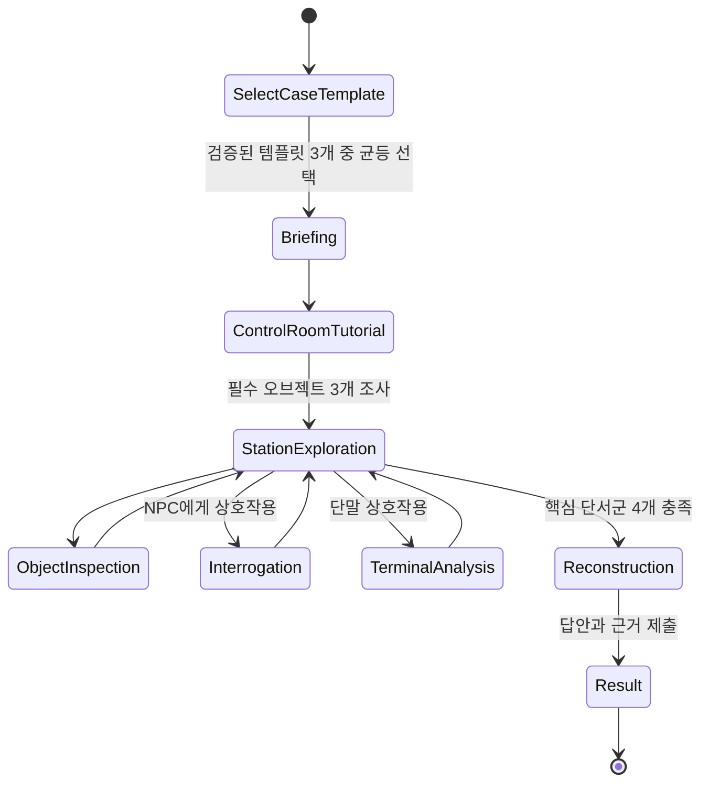

# 아르카디아 스테이션 사건 — 웹 3D MVP 게임플레이 명세

작성 기준: 2026-07-23  
대상: NAN 2026 사전 과제용 데스크톱 웹 게임  
장르: 1인칭 3D 탐색 + AI 심문 + 증거 재구성  
목표 플레이 시간: 첫 플레이 20~30분

세 사건에 따른 맵·오브젝트의 정확한 상태 차이는 [CASE_OBJECT_VARIANT_REPORT.md](CASE_OBJECT_VARIANT_REPORT.md)를 기준으로 구현한다.

## 1. 제품 결정

MVP는 **직접 우주정거장을 걸어 다니며 물증을 찾고, 그 증거를 AI 용의자에게 제시하는 1인칭 추리게임**으로 만든다.

- 3D 공간은 이동, 현장 관찰, 오브젝트 상호작용과 분위기를 담당한다.
- 2D 오버레이는 로그 분석, AI 심문, 증거 보드와 최종 추리를 담당한다.
- 서버는 게임 시작 시 검증된 `소피아·백준호·유나 사건` 중 하나를 같은 확률로 선택하고 세션 종료까지 고정한다.
- 범인, 범행 수단, 동기, 단서와 정답은 선택된 사건 템플릿의 코드와 데이터가 결정한다.
- AI는 용의자의 대사, 회피, 감정 변화, 추천 질문과 조사 기록 요약만 생성한다.
- AI 응답은 미발견 단서를 해금하거나 최종 판정을 바꿀 수 없다.
- 피해자의 실제 신원은 살인 사건 해결과 분리된 보너스 진실로 판정한다.

이 프로젝트는 오픈월드나 완전한 몰입형 시뮬레이션을 목표로 하지 않는다. 짧고 밀도 높은 정거장 한 구역을 완성하는 것이 목표다.

## 2. 경험 핵심

### 2.1 현장을 직접 확인한다

플레이어는 문서 목록에서 단서를 선택하지 않는다. 제어실 바닥의 시신, 휘어진 레버 핀, 의무실의 수상한 패치처럼 공간에 놓인 오브젝트를 직접 발견한다.

### 2.2 물증으로 AI의 거짓말을 무너뜨린다

자유 질문만 반복하는 것이 아니라, 발견한 증거 카드를 용의자에게 제시한다. 증거에 따라 서버가 AI에게 공개하는 사실이 달라지고 진술의 태도와 내용도 변한다.

### 2.3 정답은 추측이 아니라 입증한다

마지막에 범인만 고르는 것으로 끝나지 않는다. `범인 / 수단 / 동기 / 밀실 원리`에 답하고 각 결론을 뒷받침하는 증거를 연결해야 한다.

## 3. MVP 성공 기준

다음 조건을 모두 만족하면 MVP 완료로 본다.

1. 브라우저 접속 후 별도 설치 없이 플레이할 수 있다.
2. 키보드와 마우스로 시작부터 결과까지 20~30분 안에 완주할 수 있다.
3. 최초 제어실과 중앙 복도에서 일반적인 노트북 기준 45 FPS 이상을 유지한다.
4. 모든 필수 오브젝트는 수사 스캔으로 찾을 수 있어 픽셀 헌팅이 발생하지 않는다.
5. AI API 정상 시 5명의 용의자에게 자유 질문하고 증거를 제시할 수 있다.
6. AI API 실패나 지연 시 준비된 기본 응답으로 끝까지 플레이할 수 있다.
7. 정답의 네 요소는 각각 최소 2개의 서로 다른 단서로 뒷받침된다.
8. 미발견 사실은 심문 AI와 수사 보조 AI가 누설하지 않는다.
9. 최종 판정은 LLM이 아니라 서버 규칙으로 항상 동일하게 계산한다.
10. 새로고침 후 사건 진행 상태와 발견한 증거가 복구된다.
11. 세 사건 모두 필요한 범행 조건을 만족하는 인물이 정확히 한 명이다.
12. 사건별 100회 자동 테스트에서 정답, 필수 단서와 최소 해결 경로가 변하지 않는다.

## 4. 조작

| 입력 | 동작 |
|---|---|
| `WASD` | 이동 |
| `마우스` | 시점 회전 |
| `E` | 바라보는 오브젝트 또는 NPC와 상호작용 |
| `Q` | 수사 스캔: 가까운 조사 가능 오브젝트 강조 |
| `Tab` | 증거 보드 열기/닫기 |
| `Esc` | 현재 2D 화면 닫기 또는 메뉴 |

### 4.1 이동 원칙

- 걷기 속도는 고정한다.
- 점프, 앉기, 달리기, 사다리, 복잡한 물리는 넣지 않는다.
- 계단 대신 평면 통로와 짧은 경사로를 사용한다.
- 문은 접근 권한에 따라 자동으로 열리거나 잠금 메시지를 보여준다.
- 멀미 방지를 위해 카메라 흔들림과 모션 블러를 사용하지 않는다.

### 4.2 접근성

- 수사 스캔은 필수 오브젝트를 벽 너머에서 표시하지 않는다.
- 상호작용 가능 거리 안에서는 외곽선과 오브젝트 이름을 표시한다.
- 마우스 감도와 음량을 설정할 수 있다.
- 모든 음성 정보는 자막으로도 제공한다.
- 색상만으로 단서 상태를 구분하지 않고 아이콘과 텍스트를 함께 사용한다.

## 5. 3D와 2D 화면 전환

### 5.1 3D 탐색 상태

- 화면 중앙에 작은 조준점을 표시한다.
- 상호작용 가능 오브젝트를 바라보면 `E 조사: 산소 레버`처럼 행동 문구를 표시한다.
- 좌측 상단에는 현재 목표, 우측 상단에는 발견 단서 수와 조사 진행도를 표시한다.
- 새 단서를 얻으면 화면 우측에 증거 카드 알림이 나타난다.

### 5.2 2D 오버레이 상태

다음 행동은 3D 장면 위에 전체 또는 부분 화면 오버레이를 연다.

- 용의자 심문
- 제어 콘솔과 각종 단말
- 수사 보조 AI
- 증거 보드
- 최종 추리

오버레이가 열리면:

- 플레이어 이동과 시점 회전을 정지한다.
- 마우스 포인터 잠금을 해제한다.
- 3D 장면은 배경으로 유지한다.
- 화면을 닫으면 포인터 잠금을 다시 요청한다.

NPC 애니메이션이나 립싱크는 구현하지 않는다. 심문 화면에서는 3D NPC의 상반신 카메라 또는 고정 초상화를 사용한다.

## 6. 정거장 공간

정거장은 한 층의 짧은 순환 동선으로 만든다. 중앙 허브에서 각 구역까지 10~15초 안에 이동할 수 있어야 한다.

```text
                    [사령관실]
                         |
[화물·정비 구역] — [중앙 허브] — [의무실]
                         |
                  [생명유지 제어실]
                         |
                     [통신실]
```

### 6.1 중앙 허브

역할:

- 모든 구역을 연결하는 길 찾기 기준점
- 사건 목표, 조사 진행도, 구역 잠금 상태 확인
- 마야와 유나 배치

필수 요소:

- 구역 안내 홀로맵
- 정거장 상태 표시기
- 태양 플레어 경고 창
- 잠긴 사령관실 문

### 6.2 생명유지 제어실

역할:

- 게임 시작 장소
- 이동과 상호작용 튜토리얼
- 밀실 트릭의 물리·디지털 단서 제공

필수 오브젝트:

- 피해자 시신
- 피해자의 패치 또는 손목 센서
- 휘어진 수동 산소 레버
- 산소 제어 콘솔
- 생체 인증 출입문
- 손상된 경고등

### 6.3 의무실

역할:

- 소피아 사건에서는 수면유도제와 의료 원격 명령 확인
- 백준호 사건에서는 약물이 사용되지 않았음을 확인하고 소피아를 배제
- 유나 사건에서는 약물과 의료 명령이 없음을 확인하고 화물용 불활성 가스를 식별
- 소피아 심문
- 의료 기록 및 토큰 분석

필수 오브젝트:

- 소피아 NPC
- 약품 보관함
- EXP-17 패치 포장
- 의료 단말
- MED-01 토큰 보관대
- 삭제된 임상시험 기록

### 6.4 사령관실

역할:

- 선택된 사건의 감사 대상과 살인 동기 제공
- 피해자 신원 반전 제공
- 초반에는 잠겨 있고, 제어실의 사령관 키를 발견한 뒤 열린다.

필수 오브젝트:

- 소피아의 임상시험 또는 백준호의 정비 예산에 관한 감사 통보서
- 본부로 보내지 못한 보고서 초안
- 8개월 전후 서명 문서
- 정민석의 옛 신분증
- 가족사진

### 6.5 통신실

역할:

- 미전송 보고서와 사건 시간대 기록 확인
- 카심의 정보 유출 레드헤링 제공

필수 오브젝트:

- 카심 NPC
- 통신 로그 단말
- 본부 미전송 큐
- 02:00 전후 시스템 시간표
- 경쟁사 송신 기록

### 6.6 화물·정비 구역

역할:

- 유나와 백준호의 업무 비밀 및 선택된 사건의 핵심 증거 제공
- 소피아 사건에서는 백준호의 예산 착복을 레드헤링으로 제공
- 백준호 사건에서는 불량 부품과 정비용 예약 명령을 핵심 증거로 제공
- 유나 사건에서는 화물용 가스 실린더·기계식 타이머·밀수 장부를 핵심 증거로 제공
- 레버 훼손에 쓰인 공구 유형 확인

필수 오브젝트:

- 백준호 NPC
- 공구함
- 12mm 렌치 대여 기록
- 발전기 정비 기록
- 유나의 밀수 상자
- 화물 반출 기록
- AR-9 실린더 보관대
- CT-4 기계식 타이머 보관함
- 제어실로 이어지는 서비스 덕트 입구

NPC 5명을 모두 개별 방에 분산시키지 않는다. 마야와 유나는 중앙 허브, 소피아는 의무실, 카심은 통신실, 백준호는 정비 구역에 배치한다.

## 7. 사건 템플릿

### 7.1 공통 사건

세 템플릿은 다음 요소를 공유한다.

- 피해자는 01:50 자신의 생체 인증으로 생명유지 제어실에 입실한다.
- 02:00 전후 산소 농도가 치명적인 수준으로 내려간다.
- 범행 시간에 다른 사람의 출입 기록은 없다.
- 수동 비상장치는 사건 전에 고의로 무력화됐다.
- 피해자는 각 템플릿의 범인에게 감사를 예고한 상태다.
- 플레이어는 같은 정거장과 용의자 5명을 조사하지만 활성화되는 핵심 기록과 오브젝트 상태가 달라진다.

게임 시작 시 서버가 템플릿을 선택한다. AI가 범인을 정하거나 사건을 다시 쓰지 않는다.

- 첫 플레이는 세 템플릿 중 같은 확률로 선택한다.
- 진행 중 새로고침하거나 이어하기를 해도 템플릿은 유지한다.
- 사건을 완료한 뒤 `다른 사건 시작`을 선택하면 아직 플레이하지 않은 템플릿을 우선 선택한다.
- 세 템플릿을 모두 완료한 뒤에만 플레이 기록 묶음을 초기화하고 다시 세 사건을 순환한다.
- 개발·QA 환경에서만 seed로 템플릿을 강제할 수 있으며 운영 화면에는 선택 기능을 노출하지 않는다.

```ts
type CaseTemplateId =
  | "SOPHIA_MEDICAL"
  | "JUNHO_ENGINEERING"
  | "YUNA_CARGO";
```

### 7.2 템플릿 A — 소피아 의료 사건

범인: 소피아 알바레즈

동기:

- 피해자가 소피아의 미승인 수면유도제 `EXP-17` 임상시험을 발견했다.
- 피해자는 당일 08:00 감사를 예고하고 본부 보고서를 작성했다.

범행:

1. D-6, 소피아는 환경 건강 점검을 명목으로 제어실에 단독 출입해 수동 산소 레버를 훼손한다.
2. 사건 당일 01:20, 피해자의 안정 패치를 고용량 EXP-17 패치로 바꾼다.
3. 02:00, 의무실에서 의료 비상 프로토콜 `MED-O2-DIAG`를 실행해 제어실 산소를 8%로 낮춘다.
4. 약물로 운동 능력이 저하된 피해자는 손상된 레버를 작동시키지 못하고 쓰러진다.

유일성:

- `MED-O2-DIAG`는 MED-01 하드웨어 토큰과 등록자의 생체 인증이 필요하다.
- 사건 당시 MED-01의 유효 등록자는 소피아뿐이다.
- 소피아만 D-6의 물리적 공작과 D-Day의 의료 원격 명령을 모두 만족한다.

백준호의 예산 착복은 실제 비밀이지만 살인과 무관한 레드헤링이다.

### 7.3 템플릿 B — 백준호 정비 사건

범인: 백준호

동기:

- 백준호는 정품 산소 조절 부품 예산을 빼돌리고 값싼 비인증 부품 `OX-R7`으로 교체해 왔다.
- 피해자는 부품 시리얼과 예산 불일치를 발견하고 당일 정비 감사를 예고했다.

범행:

1. D-3, 백준호는 예정된 정비를 명목으로 제어실에 들어가 수동 레버의 연결축을 절단한다.
2. 제어 패널 뒤에 정비용 진단 브리지 `BRG-12`를 설치한다.
3. BRG-12에 02:00 실행되는 로컬 예약 명령 `ENG-PURGE-CAL`을 등록한다.
4. 명령이 실행되면 제어실 문이 압력 보정 모드로 봉쇄되고 산소가 배출된다.
5. 피해자는 절단된 수동 레버로 보정 모드를 해제하지 못하고 사망한다.

유일성:

- 예약 명령에는 백준호의 정비 토큰 `ENG-07` 서명이 남는다.
- BRG-12는 원격 접속이 아니라 제어실 패널 내부에서만 설치·예약할 수 있다.
- D-3 실제 제어실 정비 기록과 BRG-12 반출 기록을 동시에 만족하는 인물은 백준호뿐이다.
- 독성 검사에서 EXP-17이 검출되지 않고 MED-O2-DIAG도 실행되지 않아 소피아의 의료 비밀은 살인과 분리된다.

소피아의 미승인 임상시험은 실제 비밀이지만 피해자 사망과 직접 관련 없는 레드헤링이다.

### 7.4 템플릿 C — 유나 화물 사건

범인: 유나 조

동기:

- 유나는 정거장 희귀광물을 정식 화물에서 빼돌려 개인 화물로 위장해 밀반출하고 있었다.
- 피해자는 봉인 번호와 화물 질량의 불일치를 발견하고 당일 화물 전수 감사를 예고했다.

범행:

1. D-2, 유나는 화물 압력 점검을 명목으로 제어실 옆 서비스 덕트에 들어간다.
2. 화물용 불활성 가스 실린더 `AR-9`를 제어실 환기 라인에 연결한다.
3. 수동 레버의 해제 케이블을 화물 고정 클램프 `CL-9`로 물리고, 실린더에는 기계식 타이머 `CT-4`를 장착한다.
4. 02:00, CT-4가 실린더를 개방해 제어실을 아르곤으로 급속 치환한다.
5. 가스 방출로 압력 격리 모드가 작동하지만 피해자는 고정된 해제 케이블을 풀지 못하고 의식을 잃는다.

유일성:

- 사건 당시 AR-9 실린더의 재고·봉인 번호와 서비스 덕트 키를 함께 관리한 사람은 유나다.
- CT-4는 네트워크에 연결되지 않은 기계식 장치이므로 의료·정비 명령 로그가 존재하지 않는다.
- D-2 덕트 출입, 누락된 AR-9, CL-9 섬유와 유나의 밀수 장부를 함께 만족하는 인물은 유나뿐이다.
- 독성 검사에서 약물이 검출되지 않고 제어 패널에서도 MED-O2와 ENG-PURGE 명령이 발견되지 않는다.

소피아의 미승인 임상시험과 백준호의 예산 착복은 모두 실제 비밀이지만 살인과 무관한 레드헤링이다.

### 7.5 템플릿별 범행 조건

| 조건 | 소피아 사건 | 백준호 사건 | 유나 사건 |
|---|---|---|---|
| 사건 전 물리적 공작 | D-6 건강 점검 중 레버 훼손 | D-3 정비 중 연결축 절단·BRG-12 설치 | D-2 덕트에서 AR-9·CL-9·CT-4 설치 |
| 사건 당일 실행 | 의무실 원격 의료 명령 | 패널 내부 로컬 예약 명령 | 기계식 타이머의 가스 방출 |
| 고유 권한/물품 | MED-01 + 생체 인증 | ENG-07 + 현장 설치 | 덕트 키 + AR-9 봉인·재고 관리 |
| 피해자 무력화 | EXP-17 약효 | 압력 보정 모드의 문 봉쇄 | 아르곤 급속 치환 + 해제 케이블 고정 |
| 동기 | 미승인 임상시험 은폐 | 예산 착복·비인증 부품 은폐 | 희귀광물 밀수 은폐 |
| 핵심 배제 증거 | 다른 인물은 MED-O2 실행 불가 | 약물 미검출·의료 명령 없음 | 의료·정비 명령 모두 없음 |

### 7.6 공정성 검증 규칙

각 템플릿은 플레이 시작 전에 다음 조건을 모두 통과한 고정 데이터만 사용한다.

```text
물리적 공작 기회
AND 실행 권한 또는 서명
AND 범행 시간 조건
AND 피해자를 제거할 동기
= 정확히 1명
```

- 범인을 가리키는 독립 증거가 최소 2개다.
- 수단, 동기와 밀실 원리를 각각 설명하는 단서가 최소 2개다.
- 다른 용의자의 비밀에는 반드시 살인에서 배제되는 반증이 있다.
- 핵심 단서는 자유 질문의 성공 여부와 무관하게 공간 조사와 단말 분석으로 획득할 수 있다.
- 템플릿 선택 후 범인과 활성 단서는 세션 도중 바뀌지 않는다.

## 8. 전체 진행



### 8.1 브리핑

목표 시간: 60~90초

보여줄 정보:

- 구조선 도착까지 66시간
- 피해자: 사령관 다니엘 로스
- 발견 장소: 생명유지 제어실
- 범행 시간대의 출입 기록 없음
- 정거장에 남은 용의자 5명
- 플레이 목표: 살인 사건의 네 요소를 증거로 재구성

브리핑 종료 후 제어실 내부에서 플레이어 시점을 얻는다.

### 8.2 제어실 튜토리얼

다음 세 오브젝트를 반드시 조사한다.

1. 시신
2. 수동 산소 레버
3. 제어 콘솔

진행 방식:

- 시신에서 `E` 상호작용을 배운다.
- 레버가 잘 보이지 않으면 `Q` 수사 스캔을 안내한다.
- 콘솔에서 3D와 2D 화면 전환을 배운다.

세 개를 모두 조사하면 제어실 문이 열리고 중앙 허브로 이동할 수 있다.

제어실의 오브젝트 위치와 기본 형태는 같지만 세부 조사 결과는 선택된 템플릿에 따라 달라진다. 플레이어 화면에는 템플릿 이름이나 범인을 표시하지 않는다.

### 8.3 자유 탐색

걷기, 문 열기, 오브젝트 관찰, 심문, 심층 분석과 이미 발견한 단서 확인에는 소모성 자원을 사용하지 않는다.

- 심층 분석은 관련 오브젝트나 단말을 먼저 조사하면 열린다.
- 같은 분석을 다시 실행하면 저장된 결과를 보여주며 증거를 중복 생성하지 않는다.
- 한 심문 세션에서는 최대 3문답을 진행하고, 종료 후 같은 NPC와 새 심문을 시작할 수 있다.
- AI 요청이 서버 운영 한도를 넘거나 실패하면 정적 대사와 규칙 기반 기록 요약으로 전환한다.
- 핵심 단서는 AI 심문과 무관하게 공간 조사와 단말 분석만으로 모두 획득할 수 있다.

실제 66시간 카운트다운은 분위기 설정으로만 사용한다. 플레이를 재촉하는 실시간 타이머는 넣지 않는다.

### 8.4 구역 잠금

과도한 선형 진행을 피하되 초반 동선을 통제한다.

- 시작: 제어실만 접근 가능
- 튜토리얼 완료: 중앙 허브, 의무실, 통신실, 정비 구역 개방
- 제어실에서 사령관 키 획득: 사령관실 개방
- 의료 기록 접근권 획득: 의무실의 삭제 기록 분석 가능
- 정비 기록 접근권 획득: 정비 단말의 예약 명령과 부품 기록 분석 가능

핵심 단서를 특정 자유 질문으로만 해금하지 않는다. 장소 조사와 로그 분석만으로도 살인 정답에 도달할 수 있어야 한다.

### 8.5 최종 재구성

다음 네 항목에 답과 근거 단서를 배치한다.

1. 범인은 누구인가?
2. 어떤 수단으로 살해했는가?
3. 범행 동기는 무엇인가?
4. 출입 기록 없는 밀실 살인은 어떻게 가능했는가?

추가 진실:

5. 피해자의 실제 신원은 무엇이며 누가 은폐를 도왔는가?

`범인 / 수단 / 동기 / 밀실` 단서군을 각각 1개 이상 발견하면 최종 제출이 열린다.

## 9. 3D 상호작용 규칙

### 9.1 상호작용 대상 종류

| 타입 | 예 | 처리 |
|---|---|---|
| `OBSERVATION` | 시신의 손, 문 손상 | 짧은 관찰문과 카메라 클로즈업 |
| `EVIDENCE` | 패치 포장, 신분증 | 증거 카드 획득 |
| `TERMINAL` | 의료·통신 콘솔 | 2D 단말 화면 열기 |
| `NPC` | 소피아, 카심 | 심문 화면 열기 |
| `DOOR` | 사령관실 문 | 권한 확인 후 개방 또는 안내 |
| `WORLD_INFO` | 구역 지도, 경고창 | 세계관 정보 표시 |

### 9.2 탐지와 강조

- 기본 상호작용 거리는 2.2m다.
- 중앙 레이캐스트가 오브젝트를 맞히면 외곽선과 이름을 표시한다.
- `Q`를 누르면 6m 안의 조사 가능 오브젝트를 3초간 강조한다.
- 이미 조사한 오브젝트는 체크 아이콘을 표시한다.
- 필수 오브젝트와 배경 장식은 형태와 조명으로도 구별한다.
- 단서 발견 여부를 작은 오브젝트의 정밀한 조준에 의존시키지 않는다.

### 9.3 카메라 클로즈업

중요 오브젝트는 별도 3D 확대 모델을 만들지 않는다.

1. 플레이어 이동 정지
2. 카메라를 미리 지정한 조사 위치로 0.3초 이동
3. 관찰 포인트 1~3개 표시
4. 조사 종료 시 원래 위치로 복귀

클로즈업 중 자유 회전 범위를 제한해 카메라가 벽이나 모델 내부로 들어가지 않게 한다.

## 10. 단서 배치

### 10.1 공통 단서 슬롯

세 템플릿은 같은 장소와 상호작용 오브젝트를 재사용한다. 서버가 `caseTemplateId`에 맞는 조사 결과, 로그와 증거 카드를 반환한다.

| 단서 슬롯 | 공통 위치 | 소피아 사건 | 백준호 사건 | 유나 사건 |
|---|---|---|---|---|
| 피해자 상태 | 시신·환경 센서 → 의무실 분석기 | EXP-17 + 저산소증 | 약물 미검출 + 저산소증 | 약물 미검출 + 사건 시각의 아르곤 농도 급증 |
| 수동 장치 | 제어실 산소 레버 | 휘어진 고정핀 | 절단된 연결축 | CL-9으로 물린 해제 케이블 |
| 사전 출입 | 중앙 보안 단말 | D-6 소피아 건강 점검 | D-3 백준호 예정 정비 | D-2 유나의 덕트 압력 점검 |
| 실행 흔적 | 제어실 콘솔/덕트 | MED-O2-DIAG | ENG-PURGE-CAL 예약 | 디지털 명령 없음 + CT-4 타이머 |
| 고유 인증/물품 | 각 업무 단말 | MED-01 + 생체 인증 | ENG-07 + 작업 서명 | 덕트 키 + AR-9 봉인 번호 |
| 범행 동기 | 각 업무 구역 | 미승인 임상시험 | 예산 착복 + OX-R7 | 희귀광물 밀수 |
| 감사 통보 | 사령관실 | 소피아 연구 감사 | 백준호 정비 예산 감사 | 유나 화물 전수 감사 |
| 본부 보고 | 통신실 | 미승인 임상시험 | 부품 시리얼 불일치 | 화물 질량·봉인 번호 불일치 |

3D 모델을 전부 세 벌 만들 필요는 없다. 레버 손상 형태, 패치 잔여물, 패널 내부 BRG-12, 덕트의 AR-9처럼 결론에 직접 영향을 주는 소형 오브젝트만 템플릿별 variant를 둔다.

### 10.2 소피아 사건 핵심 단서

| ID | 구역/오브젝트 | 내용 | 결론 |
|---|---|---|---|
| `S01_TOXICOLOGY` | 의무실 분석기 | 피해자에게서 고농도 EXP-17 검출 | 수단 |
| `S02_OVERRIDE_PIN` | 제어실 레버 | D-6 전후 공구로 휘어진 고정핀 | 밀실 |
| `S03_D6_ACCESS` | 중앙 보안 단말 | D-6 소피아 단독 건강 점검 | 범인, 밀실 |
| `S04_MED_COMMAND` | 제어실 콘솔 | 의무실발 MED-O2-DIAG 실행 | 수단, 밀실 |
| `S05_MED_TOKEN` | 의무실 보안 로그 | MED-01과 소피아 생체 인증 | 범인 |
| `S06_EXP17_TRIAL` | 의무실 의료 단말 | 소피아의 미승인 임상시험 | 동기, 수단 |
| `S07_AUDIT_NOTICE` | 사령관실 | 소피아 연구 감사 통보 | 동기 |
| `S08_UNSENT_REPORT` | 통신실 | 미승인 임상시험 본부 보고 | 동기 |

### 10.3 백준호 사건 핵심 단서

| ID | 구역/오브젝트 | 내용 | 결론 |
|---|---|---|---|
| `J01_NO_DRUG` | 의무실 분석기 | 약물 미검출, 순수 저산소 사망 | 수단, 소피아 배제 |
| `J02_CUT_LINKAGE` | 제어실 레버 | 정비 절단기로 끊은 연결축 | 밀실 |
| `J03_D3_ACCESS` | 중앙 보안 단말 | D-3 백준호 단독 정비 | 범인, 밀실 |
| `J04_LOCAL_PURGE` | 제어실 패널 | BRG-12의 02:00 로컬 예약 명령 | 수단, 밀실 |
| `J05_ENG_TOKEN` | 정비 단말 | ENG-07과 백준호의 작업 서명 | 범인 |
| `J06_FAKE_PARTS` | 정비 창고/단말 | OX-R7 비인증 부품과 허위 청구 | 동기 |
| `J07_AUDIT_NOTICE` | 사령관실 | 백준호 정비 예산 감사 통보 | 동기 |
| `J08_BRG12_RECORD` | 정비 구역 | BRG-12 반출 기록과 빈 보관함 | 범인, 수단 |

### 10.4 유나 사건 핵심 단서

| ID | 구역/오브젝트 | 내용 | 결론 |
|---|---|---|---|
| `Y01_ARGON_TRACE` | 제어실 독립 환경 센서/의무실 분석기 | 01:59~02:08 아르곤 농도 급증과 약물 미검출 | 수단 |
| `Y02_CARGO_CLAMP` | 제어실 레버 | CL-9 화물 클램프로 고정된 해제 케이블 | 밀실 |
| `Y03_D2_DUCT_ACCESS` | 중앙 보안 단말 | D-2 유나의 단독 덕트 압력 점검 | 범인, 밀실 |
| `Y04_NO_DIGITAL_COMMAND` | 제어실 콘솔 | MED-O2와 ENG-PURGE 실행 기록 모두 없음 | 아날로그 실행 |
| `Y05_AR9_SERIAL` | 화물 단말/덕트 | 누락된 AR-9 봉인 번호가 현장 실린더와 일치 | 범인, 수단 |
| `Y06_SMUGGLING_LEDGER` | 화물 구역 숨겨진 장부 | 희귀광물 밀반출과 허위 화물 질량 | 동기 |
| `Y07_AUDIT_NOTICE` | 사령관실 | 유나의 화물 전수 감사 통보 | 동기 |
| `Y08_CT4_TIMER` | 서비스 덕트 | 02:00으로 설정된 기계식 CT-4 | 범인, 수단, 밀실 |

### 10.5 신원 반전 단서

| ID | 구역/오브젝트 | 내용 |
|---|---|---|
| `B01_OLD_BADGE` | 사령관실 잠긴 서랍 | 정민석 이름의 시스템 기술자 배지 |
| `B02_BIOMETRIC_MIGRATION` | 중앙 보안 단말 | 8개월 전 로스의 생체 정보 예외 재등록 |
| `B03_HANDWRITING` | 사령관실 벽면 문서 | 8개월 전후 서명 필압과 습관 불일치 |
| `B04_MAYA_APPROVAL` | 중앙 허브의 마야 | B02를 제시하면 신분 대체 승인 사실 인정 |

### 10.6 레드헤링

| ID | 적용 템플릿 | 다른 비밀 | 살인에서 제외되는 근거 |
|---|---|---|---|
| `R01_JUNHO_BUDGET` | 소피아·유나 사건 | 백준호의 부품 예산 착복 | ENG-PURGE 실행과 BRG-12 없음 |
| `R02_SOPHIA_TRIAL` | 백준호·유나 사건 | 소피아의 미승인 임상시험 | 약물 미검출, MED-O2 실행 없음 |
| `R03_YUNA_SMUGGLING` | 소피아·백준호 사건 | 유나의 희귀광물 밀반출 | AR-9·CT-4 현장 흔적 없음 |
| `R04_MAYA_RESOURCE` | 공통 | 마야의 자원 조작과 신원 은폐 | 세 사건의 고유 실행 조건 없음 |
| `R05_KASIM_LEAK` | 공통 | 카심의 경쟁사 정보 유출 | 제어실 물리 공작 기회 없음 |

레드헤링은 빈 단서가 아니다. 각 인물의 거짓말에 실제 이유를 제공하면서도 살인 조건의 교집합에서는 제외되어야 한다.

## 11. 권장 플레이 경로

### 11.1 소피아 사건

1. 제어실 시신, 레버, 콘솔 조사
2. 패치 잔여물 분석 → `S01_TOXICOLOGY`
3. EXP-17 기록 복구 → `S06_EXP17_TRIAL`
4. 사령관실에서 소피아 감사 통보 발견 → `S07_AUDIT_NOTICE`
5. D-6 출입 기록 분석 → `S03_D6_ACCESS`
6. 제어실 원격 명령 복구 → `S04_MED_COMMAND`
7. MED-01 등록자 확인 → `S05_MED_TOKEN`
8. 소피아에게 `S05_MED_TOKEN` 또는 `S07_AUDIT_NOTICE` 제시
9. 네 결론과 근거 제출

### 11.2 백준호 사건

1. 제어실 시신, 레버, 콘솔 조사
2. 피해자 독성 분석 → `J01_NO_DRUG`
3. 레버 연결축과 패널 내부 BRG-12 조사 → `J02_CUT_LINKAGE`, `J04_LOCAL_PURGE`
4. 사령관실에서 정비 감사 통보 발견 → `J07_AUDIT_NOTICE`
5. D-3 정비 출입 기록 분석 → `J03_D3_ACCESS`
6. 정비 단말에서 ENG-07 서명 확인 → `J05_ENG_TOKEN`
7. 정비 창고에서 OX-R7과 BRG-12 반출 기록 확인 → `J06_FAKE_PARTS`, `J08_BRG12_RECORD`
8. 백준호에게 `J05_ENG_TOKEN` 또는 `J07_AUDIT_NOTICE` 제시
9. 네 결론과 근거 제출

### 11.3 유나 사건

1. 제어실 시신, 레버, 콘솔 조사
2. 독립 환경 센서와 피해자 독성 분석 → `Y01_ARGON_TRACE`
3. CL-9으로 고정된 해제 케이블 확인 → `Y02_CARGO_CLAMP`
4. 디지털 실행 명령이 없음을 교차 분석 → `Y04_NO_DIGITAL_COMMAND`
5. D-2 서비스 덕트 출입 기록 확인 → `Y03_D2_DUCT_ACCESS`
6. 화물 단말에서 누락된 AR-9 봉인 번호 확인 → `Y05_AR9_SERIAL`
7. 덕트의 CT-4와 밀수 장부·감사 통보 확인 → `Y08_CT4_TIMER`, `Y06_SMUGGLING_LEDGER`, `Y07_AUDIT_NOTICE`
8. 유나에게 `Y05_AR9_SERIAL` 또는 `Y07_AUDIT_NOTICE` 제시
9. 네 결론과 근거 제출

세 경로 모두 AI 심문 없이 공간 조사와 단말 분석만으로 해결할 수 있다. 심문은 진술과 반증을 보강하지만 핵심 증거 획득의 필수 조건이 아니다.

## 12. AI 심문

### 12.1 시작

NPC 가까이에서 `E`를 누르면 심문 화면을 연다. 소모 자원 없이 시작하며 한 세션에서 최대 3문답을 진행한다.

화면 구성:

- 좌측: NPC 이름, 직책, 태도, 3D 상반신 또는 초상
- 중앙: 대화 기록
- 하단: 자유 입력과 추천 질문 2개
- 우측: 발견한 증거 1개를 제시하는 슬롯
- 상단: 남은 문답 수

### 12.2 증거 제시

증거를 제시하지 않은 질문에서는 캐릭터의 공개 정보와 준비된 거짓 진술만 사용한다. 관련 증거를 제시하면 서버가 해당 인물의 `guardedFactIds` 일부를 AI 입력에 추가한다.

예:

- 소피아 사건: 소피아 + `S07_AUDIT_NOTICE` → 감사 일정을 몰랐다는 진술과 모순
- 소피아 사건: 소피아 + `S05_MED_TOKEN` → 토큰 소유는 인정하지만 자동 실행이었다고 회피
- 백준호 사건: 백준호 + `J07_AUDIT_NOTICE` → 부품 감사를 몰랐다는 진술과 모순
- 백준호 사건: 백준호 + `J05_ENG_TOKEN` → 예약 명령의 서명을 부인하다 정비 기록과 충돌
- 백준호 사건: 소피아 + `R02_SOPHIA_TRIAL` → 미승인 연구는 인정하지만 피해자의 약물 미검출로 살인과 분리
- 유나 사건: 유나 + `Y05_AR9_SERIAL` → 실린더 분실을 주장하다 봉인 번호와 충돌
- 유나 사건: 유나 + `Y07_AUDIT_NOTICE` → 화물 감사를 몰랐다는 진술과 모순
- 유나 사건: 백준호 + `R01_JUNHO_BUDGET` → 예산 착복은 인정하지만 디지털 정비 명령 부재로 살인과 분리
- 마야 + `B02_BIOMETRIC_MIGRATION` → 피해자 신원 은폐 공개

### 12.3 AI 입력 경계

AI 입력에는 다음만 포함한다.

- 캐릭터 말투와 현재 태도
- 현재 템플릿에서 활성화된 사실만 포함한 허용 목록
- 서버가 허용한 사실 ID와 문장
- 현재까지 이 캐릭터가 한 진술
- 플레이어 질문
- 이번에 제시한 증거 ID

다른 인물의 비밀, 비활성 템플릿의 핵심 사실, 미발견 단서와 정답 데이터 전체는 넣지 않는다.

### 12.4 응답 형식

```json
{
  "answer": "그 예약 명령은 제가 등록한 것이 아닙니다.",
  "tone": "defensive",
  "revealedFactIds": ["FACT_JUNHO_ENG_TOKEN"],
  "contradictionId": "CONTRADICTION_JUNHO_SIGNATURE",
  "suggestedQuestions": [
    "ENG-07 서명은 어떻게 남았습니까?",
    "BRG-12를 마지막으로 반출한 사람은 누구입니까?"
  ]
}
```

서버 검증:

- `revealedFactIds`는 이번 요청의 `allowedFactIds` 부분집합이어야 한다.
- `contradictionId`는 서버가 정의한 모순 ID여야 한다.
- 추천 질문은 정확히 2개, 각 60자 이하로 제한한다.
- 검증 실패나 타임아웃 시 캐릭터별 기본 응답으로 교체한다.
- AI 응답으로 증거, 분석 완료, 문 잠금과 점수를 직접 변경하지 않는다.

## 13. 수사 보조 AI

수사 AI는 중앙 보안 단말과 각 구역 단말에서 사용할 수 있다. 범인을 직접 지목하는 정답 기계가 아니라, 플레이어가 접근 권한을 얻은 기록을 찾아 비교해 주는 도구다.

가능한 질문:

- “02시 전후 산소 관련 기록을 시간순으로 보여줘.”
- “사건 전 제어실에 단독 출입한 사람을 찾아줘.”
- “출입 로그와 의료·정비 로그가 맞지 않는 부분이 있나?”

MVP 로그는 30개 안팎이므로 벡터 DB를 사용하지 않는다.

1. 시간, 인물, 장소, 장비 ID를 구조화 필터로 검색한다.
2. 나머지 문장은 키워드 검색으로 후보 기록을 고른다.
3. AI는 후보 기록만 요약하고 비교한다.
4. 모든 문장에 원본 기록 ID를 붙인다.

```json
{
  "summary": "02:00 제어 패널 내부에서 예약된 산소 배출 명령이 실행됐습니다.",
  "citations": ["LOG_LOCAL_JOB_0200", "LOG_O2_0200"],
  "observation": "예약 작업에는 ENG-07 서명이 남아 있습니다.",
  "suggestedQuery": "ENG-07 토큰의 등록자와 BRG-12 반출 기록을 확인하세요."
}
```

서버는 `citations`가 현재 공개 가능한 검색 후보인지 검증한다. 근거가 없으면 `확인할 수 없습니다`를 반환한다.
예시는 백준호 사건이다. 소피아 사건에서는 MED-O2와 MED-01 기록이 반환되고, 유나 사건에서는 디지털 실행 명령이 없다는 결과와 AR-9 봉인·덕트 출입 기록을 비교한다.

## 14. 증거 보드와 최종 판정

`Tab`으로 증거 보드를 연다.

증거 보드 구성:

- 발견한 증거 카드 목록
- 인물별 진술과 모순
- 네 개의 최종 결론 슬롯
- 신원 반전 보너스 슬롯

복잡한 자유 연결선 편집은 넣지 않는다. 카드를 결론 슬롯으로 드래그하거나 선택해서 연결한다.

선택된 템플릿에 따라 정답과 유효 근거 관계표를 함께 로드한다.

소피아 사건 정답:

```json
{
  "caseTemplateId": "SOPHIA_MEDICAL",
  "culprit": "SOPHIA",
  "method": "EXP17_AND_REMOTE_OXYGEN",
  "motive": "HIDE_ILLEGAL_TRIAL",
  "lockedRoom": "D6_SABOTAGE_AND_REMOTE_MED_PROTOCOL",
  "bonusIdentity": "VICTIM_IS_MINSEOK",
  "bonusAccomplice": "MAYA"
}
```

백준호 사건 정답:

```json
{
  "caseTemplateId": "JUNHO_ENGINEERING",
  "culprit": "JUNHO",
  "method": "LOCAL_PURGE_WITH_RIGGED_BRIDGE",
  "motive": "HIDE_EMBEZZLEMENT_AND_FAKE_PARTS",
  "lockedRoom": "CUT_OVERRIDE_AND_SCHEDULED_LOCAL_COMMAND",
  "bonusIdentity": "VICTIM_IS_MINSEOK",
  "bonusAccomplice": "MAYA"
}
```

유나 사건 정답:

```json
{
  "caseTemplateId": "YUNA_CARGO",
  "culprit": "YUNA",
  "method": "ARGON_FLOOD_WITH_MECHANICAL_TIMER",
  "motive": "HIDE_MINERAL_SMUGGLING",
  "lockedRoom": "CARGO_CLAMP_AND_ANALOG_TIMER",
  "bonusIdentity": "VICTIM_IS_MINSEOK",
  "bonusAccomplice": "MAYA"
}
```

소피아 사건 유효 근거:

| 항목 | 유효 근거 |
|---|---|
| 범인 | `S03_D6_ACCESS` + `S05_MED_TOKEN` |
| 수단 | `S01_TOXICOLOGY` + `S04_MED_COMMAND` |
| 동기 | `S06_EXP17_TRIAL`, `S07_AUDIT_NOTICE`, `S08_UNSENT_REPORT` 중 최소 2개 |
| 밀실 원리 | `S02_OVERRIDE_PIN` + `S04_MED_COMMAND` |
| 신원 보너스 | `B01_OLD_BADGE`, `B02_BIOMETRIC_MIGRATION`, `B03_HANDWRITING` 중 최소 2개 |

백준호 사건 유효 근거:

| 항목 | 유효 근거 |
|---|---|
| 범인 | `J03_D3_ACCESS` + (`J05_ENG_TOKEN` 또는 `J08_BRG12_RECORD`) |
| 수단 | `J04_LOCAL_PURGE` + `J08_BRG12_RECORD` |
| 동기 | `J06_FAKE_PARTS` + `J07_AUDIT_NOTICE` |
| 밀실 원리 | `J02_CUT_LINKAGE` + `J04_LOCAL_PURGE` |
| 신원 보너스 | `B01_OLD_BADGE`, `B02_BIOMETRIC_MIGRATION`, `B03_HANDWRITING` 중 최소 2개 |

유나 사건 유효 근거:

| 항목 | 유효 근거 |
|---|---|
| 범인 | `Y03_D2_DUCT_ACCESS` + (`Y05_AR9_SERIAL` 또는 `Y08_CT4_TIMER`) |
| 수단 | `Y01_ARGON_TRACE` + `Y05_AR9_SERIAL` |
| 동기 | `Y06_SMUGGLING_LEDGER` + `Y07_AUDIT_NOTICE` |
| 밀실 원리 | `Y02_CARGO_CLAMP` + `Y08_CT4_TIMER` |
| 신원 보너스 | `B01_OLD_BADGE`, `B02_BIOMETRIC_MIGRATION`, `B03_HANDWRITING` 중 최소 2개 |

결과:

- `완전 해결`: 핵심 4개 정답과 근거가 모두 유효
- `부분 해결`: 핵심 2~3개 유효
- `오판`: 핵심 0~1개 유효
- `숨겨진 진실 발견`: 완전 해결 여부와 별도로 신원 보너스 유효

정답을 맞혔지만 근거가 없으면 `추측은 맞았으나 입증하지 못함`으로 표시한다.

## 15. 기술 구조

### 15.1 프런트엔드

- React
- React Three Fiber: 3D 장면과 상호작용
- Drei: 모델 로딩, 키보드 입력, 카메라 보조
- 정적 충돌체 또는 Rapier 캡슐 컨트롤러
- React DOM: 심문, 단말, 증거 보드와 결과 화면
- Zustand 또는 단일 게임 스토어: UI와 로컬 3D 상태

3D와 2D를 서로 다른 앱으로 나누지 않는다. 하나의 React 애플리케이션 안에서 Canvas와 DOM 오버레이를 함께 사용한다.

### 15.2 백엔드

- Spring Boot
- 게임 세션과 발견 단서 저장
- 상호작용·분석 선행 조건 검증
- LLM API 프록시
- 허용 사실 구성과 구조화 응답 검증
- 로그 검색과 최종 판정

서버가 사건 진행의 단일 진실 공급원이다. 플레이어 위치와 카메라 방향은 로컬에 저장하고, 템플릿·증거·분석 완료·문 잠금·판정은 서버가 저장한다.

`caseTemplateId`는 서버 내부 세션에는 저장하지만 일반 상태 조회 응답에는 노출하지 않는다. 클라이언트에는 현재 조사한 오브젝트의 결과와 공개 가능한 기록만 내려 범인을 네트워크 응답 한 번으로 알 수 없게 한다.

### 15.3 3D 자산 원칙

- 정거장 한 층을 하나 또는 구역별 GLB로 제작한다.
- 조명은 베이크하고 동적 조명은 경고등 등 최소한만 사용한다.
- 배경 장식에는 충돌체를 만들지 않는다.
- 문, 단말, 단서처럼 상호작용하는 오브젝트만 별도 노드로 분리한다.
- 텍스트와 정확한 숫자는 3D 텍스처가 아니라 HTML UI로 표시한다.
- 모든 인물은 고정 자세 또는 간단한 대기 애니메이션만 사용한다.

초기 성능 예산:

- 초기 다운로드 30MB 이하 목표
- 한 화면 드로우콜 150 이하 목표
- 동적 그림자 최대 1개
- 디바이스 픽셀 비율 상한 1.5

## 16. 상태 모델

```ts
type GamePhase =
  | "BRIEFING"
  | "CONTROL_ROOM_TUTORIAL"
  | "STATION_EXPLORATION"
  | "RECONSTRUCTION"
  | "RESULT";

type GameSession = {
  id: string;
  caseRunId: string;
  caseTemplateId: CaseTemplateId;
  phase: GamePhase;
  completedAnalysisIds: string[];
  discoveredEvidenceIds: string[];
  unlockedDocumentIds: string[];
  revealedFactIds: string[];
  inspectedObjectIds: string[];
  unlockedZoneIds: string[];
  interrogationSessions: InterrogationSession[];
  submittedTheory?: SubmittedTheory;
  result?: CaseResult;
};

type CaseRun = {
  id: string;
  completedTemplateIds: CaseTemplateId[];
};

type LocalExplorationState = {
  position: [number, number, number];
  rotationY: number;
  lastZoneId: string;
};
```

## 17. 최소 API

| Method | Path | 역할 |
|---|---|---|
| `POST` | `/api/sessions` | 세 검증 템플릿 중 하나를 같은 확률로 선택해 세션 생성 |
| `POST` | `/api/sessions/{id}/alternate` | 현재 플레이 기록에서 아직 완료하지 않은 템플릿으로 새 세션 생성 |
| `GET` | `/api/sessions/{id}` | 현재 진행 상태 조회 |
| `POST` | `/api/sessions/{id}/interactions/{objectId}` | 3D 오브젝트 조사와 증거 획득 |
| `POST` | `/api/sessions/{id}/analyses/{analysisId}` | 선행 조건 확인 후 심층 분석 |
| `POST` | `/api/sessions/{id}/interrogations` | 심문 세션 시작 |
| `POST` | `/api/interrogations/{id}/messages` | 질문과 증거 제시 |
| `POST` | `/api/interrogations/{id}/close` | 심문 종료 |
| `POST` | `/api/sessions/{id}/assistant` | 기록 검색과 수사 AI 요약 |
| `POST` | `/api/sessions/{id}/theory` | 최종 답과 근거 제출 |

WebSocket은 MVP에 필요하지 않다. 먼저 REST로 구현하고 답변 지연이 실제 테스트에서 문제가 될 때 텍스트 스트리밍만 추가한다.

## 18. 개발 순서

### 슬라이스 1 — 3D 수직 프로토타입

구현:

- 중앙 허브와 제어실 회색 박스맵
- WASD 이동과 마우스 시점
- 벽 충돌
- E 상호작용과 Q 수사 스캔
- 시신, 레버, 콘솔 임시 오브젝트

검증:

- 10분 동안 벽 끼임과 추락 없이 이동
- 세 필수 오브젝트를 모두 발견 가능
- 콘솔 오버레이를 열고 닫은 뒤 이동 정상 복구

### 슬라이스 2 — 사건 규칙 엔진

구현:

- 소피아·백준호·유나 사건의 인물, 단서, 사실, 문서와 정답 관계 seed
- 세션 생성 시 템플릿 균등 선택 및 불변 저장
- 상호작용, 분석 선행 조건, 단서 해금, 구역 잠금, 최종 판정

검증:

- 세 템플릿 모두 최소 경로로 완전 해결 가능
- 템플릿마다 범행 조건을 모두 만족하는 인물이 정확히 1명
- 사건별 100회 생성에서 정답과 활성 단서 불변
- 강제 QA seed로 각 템플릿을 재현 가능하되 운영 UI에는 선택 기능 미노출
- 같은 오브젝트 반복 조사로 증거가 중복되지 않음
- 잘못된 근거로 정답을 제출하면 입증 실패

### 슬라이스 3 — 완주 가능한 게임

구현:

- 모든 구역 회색 박스맵
- 전체 오브젝트와 NPC 배치
- 정적 기본 대화
- 단말, 증거 보드, 최종 결과

검증:

- AI 연결 없이 30분 이내 완주
- 세 사건을 각각 처음부터 결과까지 완주
- 분석이나 심문 횟수 때문에 소프트락되지 않음
- 새로고침 후 서버 진행과 로컬 위치 복구

### 슬라이스 4 — AI 심문과 수사 AI

구현:

- 허용 사실 구성
- 구조화 응답 검증
- 기록 검색과 인용 검증
- 타임아웃과 기본 응답

검증:

- 미발견 핵심 사실 누설 테스트
- 프롬프트 주입 질문에 시스템 정보 미노출
- AI API 차단 상태에서도 완주
- 모든 수사 AI 답변에 유효한 원본 ID 또는 확인 불가 표시

### 슬라이스 5 — 아트와 제출 QA

구현:

- 회색 박스맵을 최종 GLB로 교체
- 베이크 조명, 경고등, 환경음
- 성능 최적화
- 요청 수, 토큰, 시간, 오류와 예산 로그

검증:

- 배포 빌드에서 목표 FPS 충족
- 브라우저 번들에 API 키가 없음
- 30~60초 영상에 이동, 물증 발견, AI 심문, 증거 제시와 최종 추리가 모두 보임

## 19. NAN 2026 제출 대응

공식 페이지에서 확인되는 사전 과제 제출물:

1. 플레이 가능한 웹/모바일 빌드와 전체 소스 코드
2. 실제 플레이 중심 30~60초 YouTube 영상
3. 게임 소개 및 설명 PDF
4. AI 활용 기술 PDF
5. 팀원 롤 기술서 PDF(개인 참가 생략)

개발 시 주의:

- 심사자가 별도 유료 라이선스나 개인 API 키 없이 플레이할 수 있어야 한다.
- LLM API 키는 서버에 두고 팀 계정에서 심사 비용을 부담한다.
- AI 장애 시 기본 대화로 게임을 계속 진행한다.
- 소스 저장소는 커밋 기록을 유지한다.
- 외부 에셋, 오픈소스와 생성형 AI의 출처 및 라이선스를 기록한다.
- 제출용 릴리스 태그와 실제 배포 버전을 함께 고정한다.
- 공개된 공식 안내에는 본선의 구체 제출물과 심사 배점이 없으므로 확인되지 않은 항목을 필수 요구사항으로 간주하지 않는다.

## 20. MVP에서 하지 않을 일

- 넓은 오픈월드 정거장
- 점프, 전투, 복잡한 물리 퍼즐
- 자율적으로 이동하는 NPC
- 표정 연기, 립싱크와 대화 모션
- 검증된 3개를 넘는 범인 템플릿 추가
- AI가 범인을 직접 선택하거나 템플릿 규칙을 변경
- AI가 트릭과 필수 단서를 자유 생성
- 벡터 DB
- WebSocket 기반 대화 세션
- 런타임 초상이나 단서 이미지 생성
- 복잡한 자유 증거 연결선 편집
- 실시간 66시간 카운트다운
- 멀티플레이와 계정 시스템

위 기능은 3D 이동, 필수 단서 발견, AI 심문과 최종 판정의 완주율이 검증된 뒤에만 검토한다.
