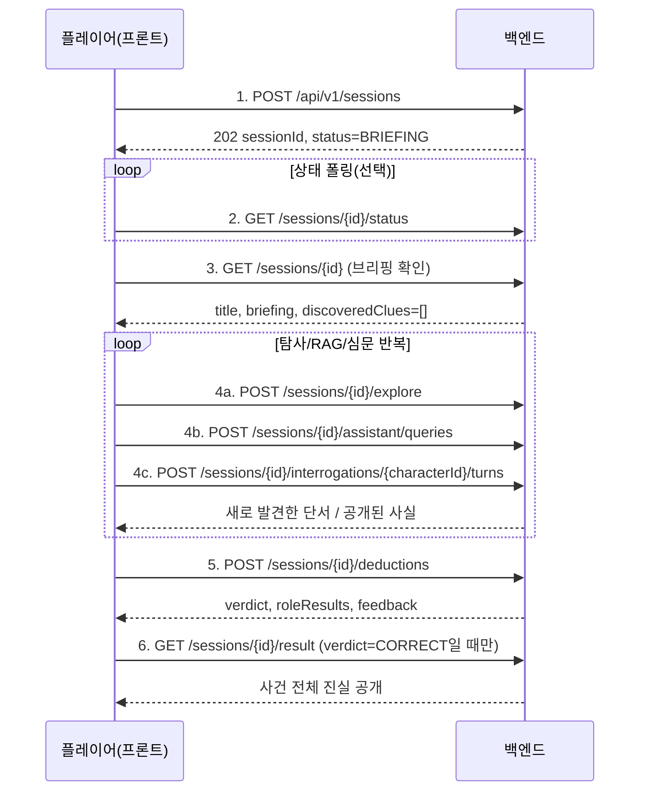

# 게임 플레이 흐름 (시작 ~ 종료)

> 현재 구현된 백엔드 API(`docs/arcadia-station-backend-spec.md` 7장)를 기준으로, 플레이어가 실제로
> 거치는 화면/요청 순서를 정리했다. 예시 값은 전부 실제로 로컬 서버를 띄워 curl로 검증한 결과다
> (Fake AI 클라이언트 기준 — 데모 사건 "아르카디아 스테이션 사건", 범인 SOPHIA).

## 한눈에 보는 흐름



---

## 1단계 — 세션 생성

```http
POST /api/v1/sessions
Content-Type: application/json

{}
```

```json
{
  "success": true,
  "data": { "sessionId": "game_ec3c9086655e4179842cc9e851673a7f", "status": "BRIEFING" }
}
```

- 프론트는 바로 이 시점부터 `sessionId`를 저장해두고 이후 모든 API에 경로 파라미터로 넣는다.
- 실제 AI 서버 연동 시에는 `status`가 `CREATING`으로 오고 몇 초~수십 초간 아래 상태값이 바뀌는데, 지금은 Fake 클라이언트가 즉시 사건을 만들어주기 때문에 첫 응답부터 `BRIEFING`이다.
- 세션 상태값 흐름: `CREATING → VALIDATING → READY → BRIEFING → INVESTIGATION → DEDUCTION → COMPLETED` (실패 시 `FAILED`)

## 2단계 — 상태 폴링 (생성 대기 화면)

```http
GET /api/v1/sessions/{id}/status
```

```json
{ "success": true, "data": { "sessionId": "...", "status": "BRIEFING" } }
```

- 실제 AI 서버 연동 후에는 프론트가 이 API를 몇 초 간격으로 폴링하면서 "사건 생성 중..." 로딩 화면을 보여주다가, `status`가 `BRIEFING`(또는 `FAILED`)이 되는 순간 다음 화면으로 넘어가면 된다.

## 3단계 — 브리핑 확인

```http
GET /api/v1/sessions/{id}
```

```json
{
  "success": true,
  "data": {
    "sessionId": "...",
    "status": "BRIEFING",
    "title": "아르카디아 스테이션 사건",
    "briefing": "생명 유지 시스템이 갑작스레 정지했다. 승무원 소피아를 포함한 용의자들을 조사하라.",
    "discoveredClues": [],
    "suspectCharacterIds": ["SOPHIA"]
  }
}
```

- 이 화면이 플레이어가 처음 보는 "사건 개요" 브리핑이다. `culpritId`/`solution` 같은 정답 관련 필드는 이 응답에 절대 없다(10장 보안 경계).
- `suspectCharacterIds`는 4c(NPC 심문) API의 `{characterId}` 경로에 넣을 수 있는 값 목록이다. 단서 발견 여부와 무관하게 브리핑 시점부터 전부 내려온다.
- 이후 첫 탐사 요청을 보내는 순간 세션은 내부적으로 `INVESTIGATION` 상태로 자동 전환된다(스펙에 별도 전환 API가 없어 첫 행동 시점에 자동 승격하도록 처리함).

## 4단계 — 조사(탐사 / RAG 검색 / 심문) — 반복

플레이어는 이 세 가지를 원하는 순서·횟수로 자유롭게 반복하며 단서를 모은다.

### 4a. 장소 탐사

```http
POST /api/v1/sessions/{id}/explore
{ "locationId": "MEDICAL_BAY" }
```
```json
{
  "success": true,
  "data": [
    { "clueId": "CLUE-SETUP-LOG", "title": "의료 안전 점검 예약 기록", "clueType": "DIGITAL",
      "playerText": "의료 베이 단말기에 소피아 명의로 안전 점검 예약 기록이 남아있다." }
  ]
}
```
- 아직 해금 조건을 못 채웠거나 없는 장소면 `data: []`가 온다(에러 아님).
- 여러 단서를 조합하면 `CONNECT` 타입의 보너스 단서가 자동으로 같이 해금되기도 한다(연쇄 해금).

### 4b. 사건기록 검색(RAG)

```http
POST /api/v1/sessions/{id}/assistant/queries
{ "question": "02:05 안전 진단 기록을 보여줘" }
```
```json
{
  "success": true,
  "data": {
    "answer": "02:05 생명 유지 시스템에서 의료 안전 진단이 실행됐다.",
    "citedRecordIds": ["RECORD-TRIGGER"],
    "suggestedQueries": ["다른 시각의 기록도 보여줘", "다른 인물 관련 기록을 보여줘"],
    "newlyDiscoveredClues": [
      { "clueId": "CLUE-TRIGGER-LOG", "title": "02:05 안전 진단 감사 로그", "clueType": "DIGITAL",
        "playerText": "02:05에 소피아의 인증으로 의료 안전 진단 작업이 실행됐다." }
    ]
  }
}
```
- 자연어 질문으로 검색하고, 검색 결과로 새 단서가 직접 해금될 수도 있다(장소 탐사 없이).

### 4c. NPC 심문

```http
POST /api/v1/sessions/{id}/interrogations/SOPHIA/turns
{ "question": "그 기록을 설명해 주세요.", "presentedClueIds": ["CLUE-TRIGGER-LOG"] }
```
```json
{
  "success": true,
  "data": {
    "dialogue": "그 증거를 보여주신다면... 인정할 수밖에 없겠네요.",
    "emotion": "DEFENSIVE",
    "revealedFactIds": ["FACT-TRIGGER"],
    "recommendedQuestions": [
      { "topicId": "TOPIC-537062017", "label": "안전 점검 예약의 목적" },
      { "topicId": "TOPIC-1621918791", "label": "02:05 진단 실행 시각" }
    ]
  }
}
```
- `presentedClueIds`에는 **이미 발견한 단서 ID만** 넣을 수 있다. 아직 못 찾은 단서를 제시하면 400 에러.
- 한 번 제시한 단서는 이후 턴에서 다시 안 보여줘도 그 세션·그 NPC 기준으로는 계속 "제시한 것"으로 인정된다.
- `recommendedQuestions`는 다음 질문 버튼/칩 UI로 쓰면 된다(항상 2개).

이 세 가지를 반복해서 원하는 만큼 단서를 모으고, 언제든 `GET /api/v1/sessions/{id}`로 지금까지 모은 단서 목록(`discoveredClues`)을 다시 확인할 수 있다.

## 5단계 — 최종 추리 제출

```http
POST /api/v1/sessions/{id}/deductions
{
  "culpritId": "SOPHIA",
  "evidenceByRole": {
    "SETUP": "CLUE-SETUP-LOG",
    "TRIGGER": "CLUE-TRIGGER-LOG",
    "OPPORTUNITY": "CLUE-ACCESS-HISTORY",
    "MOTIVE": "CLUE-MOTIVE-MESSAGE"
  }
}
```

**정답인 경우:**
```json
{
  "success": true,
  "data": {
    "verdict": "CORRECT",
    "culpritCorrect": true,
    "roleResults": { "SETUP": "CORRECT", "TRIGGER": "CORRECT", "OPPORTUNITY": "CORRECT", "MOTIVE": "CORRECT" },
    "remainingAttempts": 3,
    "feedback": "정확한 추리입니다. 사건의 전모가 드러났습니다."
  }
}
```
→ 세션 상태가 `COMPLETED`로 바뀌고, 6단계(`/result`)가 열린다.

**부분/오답인 경우** (예: 범인은 맞는데 증거 하나가 틀림):
```json
{
  "verdict": "PARTIAL",
  "culpritCorrect": true,
  "roleResults": { "SETUP": "CORRECT", "TRIGGER": "CORRECT", "OPPORTUNITY": "INCORRECT", "MOTIVE": "CORRECT" },
  "remainingAttempts": 2,
  "feedback": "범인은 맞지만 기회와 권한 증거를 다시 확인해야 합니다."
}
```
- 오답/부분정답은 시도 횟수를 1 소진한다(정답은 소진 안 함). 기본 3회까지 오답 가능, 초과하면 이후 제출은 409 에러로 차단된다.
- 오답 피드백에는 정답 단서 ID나 아직 못 찾은 사실이 절대 노출되지 않는다.

## 6단계 — 사건 전체 공개 (COMPLETED 이후에만)

```http
GET /api/v1/sessions/{id}/result
```
```json
{
  "success": true,
  "data": {
    "sessionId": "...",
    "culpritId": "SOPHIA",
    "truthSummary": "소피아가 의료 안전 점검을 가장해 생명 유지 시스템을 정지시켰다.",
    "method": { "...실제 수법 전체..." },
    "timeline": [ "...전체 사건 타임라인..." ],
    "facts": [ "...전체 사실 목록(발견 여부 무관)..." ],
    "alibis": [ "...각 인물의 실제 행적..." ],
    "solution": { "...정답 근거 전체..." }
  }
}
```
- `COMPLETED` 상태가 되기 전에 이 API를 호출하면 409 에러가 난다. 정답을 맞히기 전까지는 절대 조회할 수 없다.
- 이 화면이 게임의 엔딩 크레딧/사건 리캡 화면에 해당한다.

---

## 참고 — 에러/예외 상황

| 상황 | 응답 | 프론트 처리 힌트 |
|---|---|---|
| 존재하지 않는 sessionId 조회 | 404 | "세션을 찾을 수 없습니다" |
| 발견 못 한 단서를 심문/판정에 제시 | 400 | 프론트에서 애초에 미발견 단서를 선택 못 하게 막는 게 안전 |
| 오답 3회 초과 후 재제출 | 409 | "더 이상 제출할 수 없습니다" 안내, 게임은 그대로 진행 가능(탐사/심문은 계속 가능) |
| `COMPLETED` 이전에 `/result` 조회 | 409 | 정답 맞히기 전엔 버튼 비활성화 |
| AI 서버가 일시적으로 세션을 잃어버림(실제 연동 시) | 200(정상 응답 형태) + "지금은 대답할 수 없습니다" | 게임이 죽지 않고 안전 문구로 계속 진행됨 — 별도 에러 처리 불필요 |
